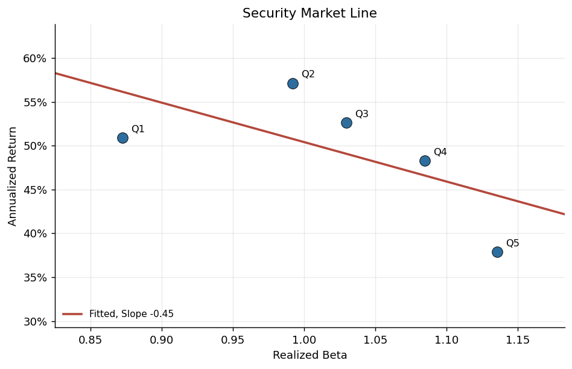
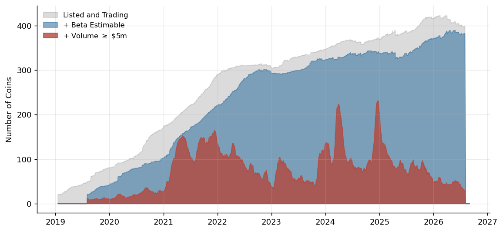
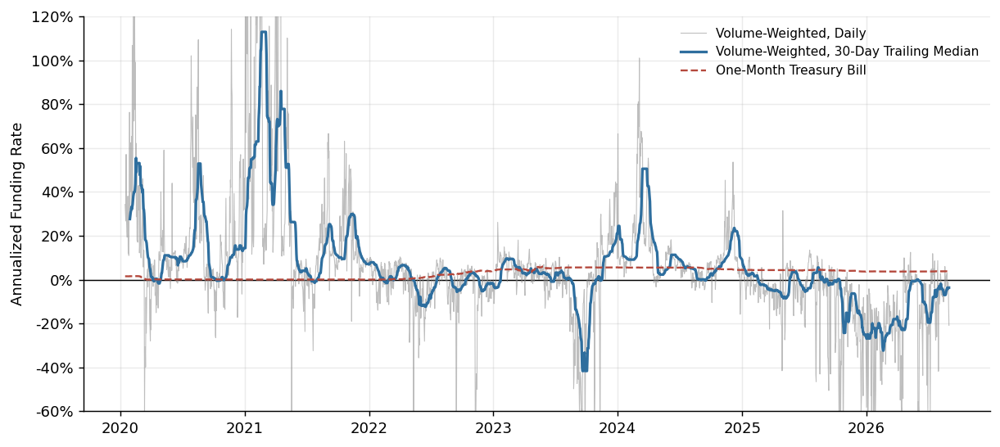
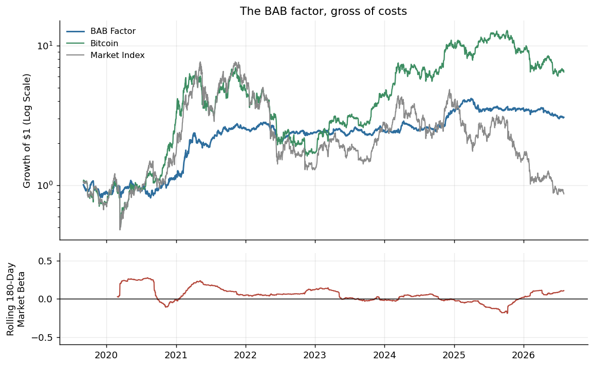
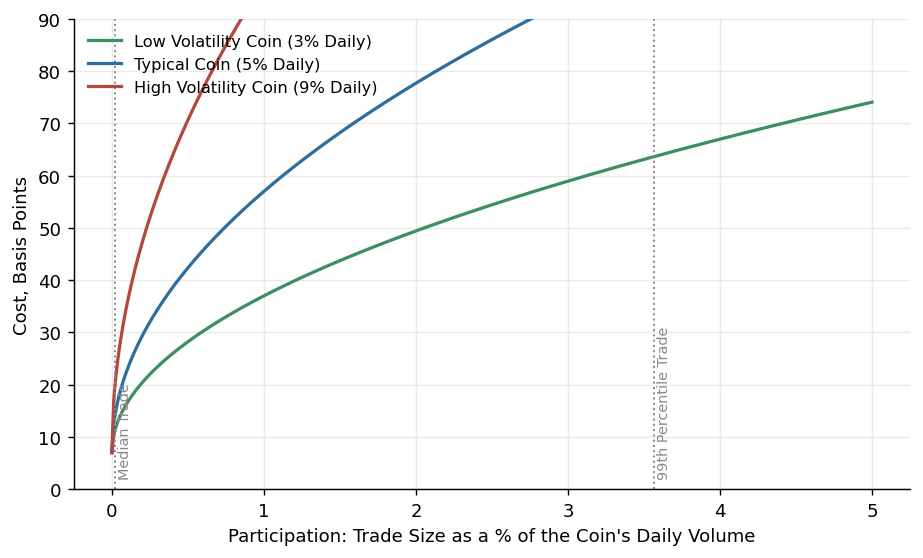
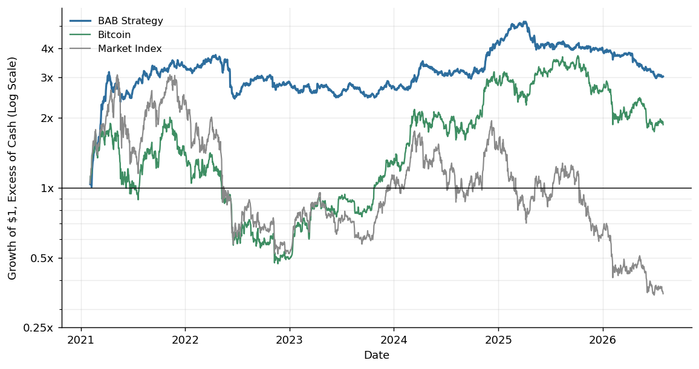
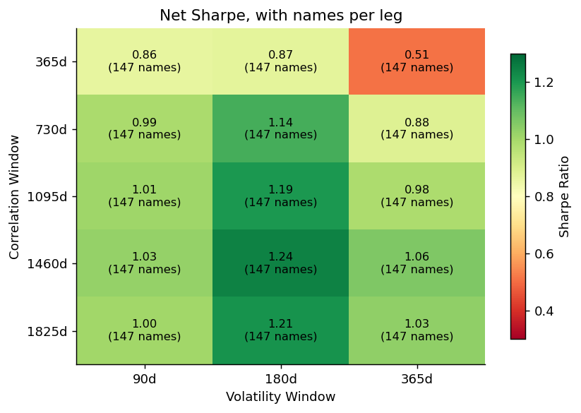
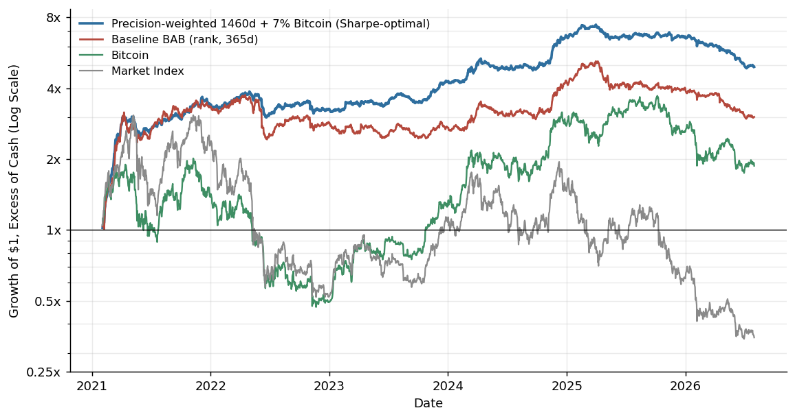

# Betting Against Beta in Crypto

## Introduction

Frazzini and Pedersen (2014) (referred to as FP) find that a portfolio which holds long leveraged low-beta assets and shorts high-beta assets (the betting against beta factor) earns substantial positive risk-adjusted returns. They explain this through a model with leverage and margin constraints. Rational agents will optimally hold the portfolio with the maximal Sharpe ratio, and then lever this portfolio to suit their risk preferences. 

However if individuals face leverage constraints, such as mandates for index funds or limited access for retail investors, then they may overweight risky securities to achieve their desired level of risk. This suggests that risky high-beta assets may be overpriced. An unconstrained arbitrageur could potentially take advantage of this mispricing, and the BAB factor is constructed to do just that. The authors show that this factor admits high risk-adjusted returns in a variety of major asset classes, such as US equities, international equities, US treasuries, and commodities. Additionally, the flat nature of the security market line and the correlation over time between their factor and proxies for leverage constraints further support their interpretation.

In this analysis I wish to examine the betting against beta phenomenon in the cryptocurrency market. I chose this market for two primary reasons: first, the cryptocurrency market is relatively younger and generally thought to be less efficient than the US equities and credit markets, second, we can use funding rates for perpetual future swaps as a direct measure for the cost of leverage.

I begin with some motivation to guide our expectations. I then use FP's conventions to construct the BAB factor in the cryptocurrency market. Finally, I examine the tradeability of the BAB factor in the crypto market.

## Motivation

I begin by plotting the security market line (SML) in the crypto market. I will cover the exact construction of beta more extensively, but in essence it represents the correlation of a particular asset's return with the market return. Here I construct the market return as a volume-weighted average return of all cryptocurrencies, mirroring the value-weighted return variable from CRSP. To construct the SML I bin the betas by their ex-ante beta and their data point is characterized by their realized beta.



| Beta Quintile | Realized Beta | Annual Return | CAPM Alpha | Sharpe |
|---|---|---|---|---|
| Q1 (lowest beta) | 0.87 | 50.9% | **+26.8%** | 0.70 |
| Q2 | 0.99 | 57.1% | +29.8% | 0.70 |
| Q3 | 1.03 | 52.6% | +24.2% | 0.62 |
| Q4 | 1.08 | 48.3% | +18.4% | 0.55 |
| Q5 (highest beta) | 1.14 | 37.9% | **+6.6%** | 0.41 |

*Quintiles are formed on lagged beta and rebalanced monthly. The fitted line slopes at -0.45 and CAPM alpha falls from +26.8% a year in the lowest beta quintile to +6.6% in the highest.*

### Testing the slope

The plot above is the Black, Jensen & Scholes (1972)
presentation, but we can also run the traditional Fama and MacBeth (1973) test: cross-sectional regression of returns on the previous day's beta each day, and take the
time-series mean of the daily slopes.

```python
# one-month Treasury bill (FRED series DGS1MO), the standard risk-free rate
rf = pd.read_pickle(os.path.join(DATA, 'riskfree.pkl'))['DGS1MO'] / 365
exc = ret.sub(rf, axis=0)

# Fama-MacBeth: cross-sectional regression of excess returns on lagged beta
betaLag = beta.shift()

rows = {}
for dt in exc.index:
    x, y = betaLag.loc[dt], exc.loc[dt]
    ok = x.notna() & y.notna()
    if ok.sum() >= 30:                       # need a real cross-section
        rows[dt] = sm.OLS(y[ok].values, sm.add_constant(x[ok].values)).fit().params

fm = pd.DataFrame(rows).T
fm.columns = ['intercept', 'slope']

fmTable = pd.DataFrame({
    'estimate':  fm.mean() * 365,
    't_stat':    fm.mean() / fm.std() * np.sqrt(len(fm)),
    'capm_says': [0.0, (mkt - rf).mean() * 365],   # zero intercept, market excess return
})
```

| | Estimate | t | CAPM Says |
|---|---|---|---|
| intercept | **+0.885**/yr | **+2.33** | 0 |
| slope | −0.392/yr | −0.88 | +0.330 |

*2,504 daily cross-sections. Under CAPM we expect an intercept equal to 0 and a slope equal to the market's expected excess return.*

Here the slope represents the expected excess return per unit of beta above the risk-free rate. Setting $\beta=1$ should then give the market's expected excess return above that of a $\beta=0$ asset (which should be 0). We find that is statistically indistinguishable from 0, whereas the expected return on a $\beta=0$ asset is extremely high.

Interestingly, here we have reproduced the classic finding from
Black, Jensen & Scholes (1972) that the empirical security market line in US equities sits too high and is too flat. This implies that high-beta stocks are too expensive relative to low-beta stocks, as their increased risk is not compensated by increased return. This pattern opens the door for the betting against beta factor portfolio to earn positive risk-adjusted returns. Next I will describe the data used for this project, discuss the factor construction (following FP), and analyze its performance in the crypto market over time.

---

## Data

I use the Binance archive to pull spots, volumes, and perpetual funding rates for the universe of coins until July 2026. I use the archive specifically because it contains data on delisted coins (which the live API does not) in order to prevent any survivorship bias stemming from sample selection. In line with the cryptocurrency asset class designations of most major indexers, I drop leveraged tokens, stablecoins, and tokenized equities.

We begin the sample on the first day the panel holds at least 20 coins (2019-01-17). Before that the
cross-section is essentially just Bitcoin and Ethereum, so there is no way to meaningfully construct a market index. Below I have plotted the number of total coins in the universe, for how many we can compute their beta, and how many have above a $5 million daily volume. 



*Coins listed and trading, those with an estimable beta, and those also clearing $5m daily volume.*

Notice here that the number of coins above a $5m average daily trading volume is very volatile. This will be important to keep in mind when we begin constructing tradable strategies. If performance varies when we limit our portfolio to only hold coins above a certain level of liquidity then this is likely due to certain coins coming in and out of the sample.

I also use data on perpetual swap funding rates. A perpetual swap has no expiry, so the exchange keeps its price tied to the spot price by initiating a transfer between those holding long and short positions. When the perpetual trades above spot, longs pay shorts, and vice versa when the perpetual trades below spot. An arbitrageur could borrow at the risk-free rate, buy at the spot price, and short the perpetual. In a frictionless market this should drive the funding rate to the risk-free rate. Therefore we can think of the funding rate (excess of the risk-free rate) as the price of leverage. This is the primary dimension on which cryptocurrency data has a distinct advantage.



*Volume-weighted funding rate across coins, annualized, against the one-month Treasury bill. Weighting by volume gives the cost faced by the average dollar of perpetual notional.*

The median is 3.3% a year against a risk-free rate averaging 2.8%, so the premium for leverage is about half a percentage point. We see the funding rate rise to over 100% during 2021 when crypto prices were surging, indicating strong demand for leveraged long positions. Subsequently the funding rate decreased and has been persistently negative since 2025, meaning those holding short positions are subsidizing those with long positions. The fact that the price of leverage moves with market conditions is encouraging, as this is what we would expect. Next I will transition to defining beta in the context of the cryptocurrency market.

---

## Defining Beta

We construct the market index as a 30-day rolling volume-weighted return across all spot coins, standing in for CRSP's value-weighted index. Cryptocurrency market capitalization is inconsistently reported, so dollar volume is the practical weighting scheme here. Some other options are equal weighting, a top-N basket, or simply Bitcoin. The broad indices behave similarly to each other, but Bitcoin alone becomes a worse proxy over time as more coins are introduced and other coins gain trading volume.

```python
# read in spot returns
ret = pd.read_pickle(os.path.join(DATA, 'ret.pkl'))

# Market return index, rolling monthly volume weighted
adv = volume.rolling(30, min_periods=15).mean()

# only use volumes where there's a return
w = adv.where(ret.notna())

# normalize weights
w = w.div(w.sum(axis=1), axis=0)

# market index return
mkt = (w.shift() * ret).sum(axis=1, min_count=1)
```

Now that we have a market return we can start calculating our betas. We use Frazzini and Pedersen's construction from eq. (14)

$$\hat\beta_i \;=\; \hat\rho_{i,m}\,\frac{\hat\sigma_i}{\hat\sigma_m}$$

Here the two inputs are deliberately estimated on different windows, because in general correlations are more stable than volatilities:

- $\hat\sigma_i,\ \hat\sigma_m$: standard deviation of daily log returns
  over a rolling **180 days** (minimum 90 observations)
- $\hat\rho_{i,m}$: correlation of **three-day overlapping sums** of log
  returns over a rolling **365 days** (minimum 182 observations)


```python
# volatity: 6-month window, need at least 3 months, from daily log returns
vol = ret.rolling(180, min_periods=90).std()

# correlation: 1 year window, need at least 6 months, from 3 day log returns
ret3day = ret.rolling(3).sum()
corr = ret3day.rolling(365, min_periods=180).corr(ret3day['mkt'])
tsBeta = (corr*vol).divide(vol['mkt'],axis=0)
```
One additional note is that FP actually 1-year rolling volatilities and 5-year rolling correlations, but I have compressed these timeframes to better fit the data we actually have. Spot price data begins in 2019 for our sample, so a 5-year rolling window throws out the vast majority of available data. The three-day aggregation for correlations is FP's correction for non-synchronous trading.

To reduce the impact of outliers, the time-series estimate of $\beta$ is then shrunk toward the cross-sectional mean $\beta^{XS}$:

$$\hat\beta_i^{\,\text{shrunk}} \;=\; w_i\,\hat\beta_i + (1-w_i)\hat\beta^{XS} $$

This is estimated for every coin on every date. A coin's beta drifts as its correlation and relative volatility change: Bitcoin's runs between 0.64 and 1.01 over the sample. For simplicity FP impose $w = 0.6$ and $\beta^{XS}=1$ for US equities, but we can also estimate these from the data. We will show later that the BAB factor's performance is not extremely sensitive to the choice of weighting.

```python
# calculate weight manually
corr_ = corr.drop(columns=['mkt'])
n_obs  = ret3day.drop(columns=['mkt']).rolling(365, min_periods=182).count()
n_eff  = n_obs / 3

# calc variances
varXS = tsBeta.drop(columns=['mkt']).var(1)
varTS = tsBeta.drop(columns=['mkt'])**2 * (1 - corr_**2) / (n_eff * corr_**2)

# shrinkage
w = 1 / (1 + varTS.div(varXS, axis=0)) # about 0.85 on average

# convention of xs beta = 1
betaShrunk = w * tsBeta.drop(columns=['mkt']) + (1 - w) * 1.0 
```

Shrinking pulls each estimate toward the cross-sectional mean, which leaves the ranking untouched. This means it does not change which coins land in which leg, however it does affect the scaling applied to each leg and therefore the factor's residual market exposure. 

---

## Factor Construction

We have our market index and betas, so I now follow the conventions in FP to construct the BAB factor. Coins are ranked by beta each month, the ranks are demeaned, and the deviations are normalized so that each side of the portfolio sums to one. The portfolio goes long the low-beta half and short the high-beta half, and each leg is then scaled by the reciprocal of its
own beta so that both sides carry a beta of one (eq. 17 from FP). This scaling is what makes the combination market neutral without requiring any single position to be levered. The portfolio is then rebalanced monthly to reduce turnover.

```python
# read in betas
beta = pd.read_pickle(os.path.join(DATA, 'betaShrunk.pkl'))

# rank at each time period
betaRank = beta.rank(1)
avgRank = betaRank.mean(1)
k = 2 / abs(betaRank.subtract(avgRank, axis=0)).sum(axis=1)

# portfolio weights
wH = betaRank.subtract(avgRank, axis=0).clip(lower=0).multiply(k, axis=0)
wL = -betaRank.subtract(avgRank, axis=0).clip(upper=0).multiply(k, axis=0)

# monthly rebalancing
first = ~beta.index.to_period('M').duplicated()
mask = pd.DataFrame(np.broadcast_to(first[:, None], beta.shape),
                    index=beta.index, columns=beta.columns)

wH = wH.where(mask).ffill().where(beta.notna())
wL = wL.where(mask).ffill().where(beta.notna())
beta_held = beta.where(mask).ffill().where(beta.notna())

# make high and low components
retH = (wH.shift()*ret).sum(axis=1, min_count=1)
retL = (wL.shift()*ret).sum(axis=1, min_count=1)
betaH = (wH.shift()*beta_held.shift()).sum(axis=1, min_count=1)
betaL = (wL.shift()*beta_held.shift()).sum(axis=1, min_count=1)

# compute factor returns
retBAB = (1/betaL)*retL - (1/betaH)*retH
```

### Performance

Next I compare the BAB factor's performance with that of the market index and Bitcoin.



| Strategy | Sharpe | Annual Return | Volatility | Max Drawdown | Market $\beta$ | Alpha | Alpha t |
|---|---|---|---|---|---|---|---|
| BAB Factor | **0.751** | 19.7% | **26.2%** | **-28.4%** | +0.078 | **+17.5%** | +1.77 |
| Bitcoin | 0.707 | 45.7% | 60.6% | -76.6% | +0.711 | +26.1% | +2.24 |
| Market Index | 0.327 | 27.6% | 75.8% | -88.8% | 1.000 | - | - |

*All three over 2019-09 to 2026-07, 2,525 days. The BAB factor is self-financing, so its raw return is already an excess return. The Bitcoin and market Sharpes are net of the one-month Treasury bill. Alpha and $\beta$ for the market index are 0 and 1 by construction.*

The Sharpe ratio of the BAB factor is around $0.75$, which is remarkably similar to FP's results from US equities. It is also greater than the Sharpe ratios of both Bitcoin and the market index. The BAB factor has lower average returns with substantially lower volatility and a much smaller maximum drawdown than either of the other two strategies. 

Our BAB factor earns a positive alpha of roughly 17.5% a year with almost no market exposure, though this estimate is not extremely precise. Over the same period, Bitcoin has an alpha of 26.1%, which is significant and positive. On average, Bitcoin is about 1/4 of the market index and has much higher market exposure than the BAB factor, with $\beta=0.711$. This suggests that we can construct a portfolio by combining the BAB factor with Bitcoin to further increase the Sharpe ratio, which is an exercise I consider in the tradability section.

One interesting note, the median beta of Bitcoin is about 0.8, whereas the cross-section average is around 1. This means Bitcoin sits in the lowest-beta quintile for almost 90% of days. However, our weighting scheme essentially captures the average low and high-beta coins, and here the average low-beta coin did far worse than Bitcoin. This suggests that a BAB factor which instead overweights large low or high-beta assets may perform better, but at the cost of being more highly correlated to Bitcoin. We will examine this exercise as well when we turn to the practical implementation of the BAB factor.

### Robustness: Shrinkage

Next I will vary the degree of shrinkage $w$ we implement in factor construction. 

| Shrinkage | Realized $\beta$ | t | Alpha | Sharpe | Ann. Vol |
|---|---|---|---|---|---|
| none (w = 1.0) | 0.269 | 10.12 | 18.9% | 0.774 | 34.0% |
| Vasicek (w = 0.87) | 0.151 | 7.13 | 17.2% | 0.760 | 28.1% |
| FP constant (w = 0.6) | 0.078 | 3.35 | 17.5% | 0.751 | 26.2% |
| over-shrunk (w = 0.4) | -0.016 | -0.69 | 16.9% | 0.650 | 25.4% |

In general, the performance statistics of the BAB factor do not vary much with the degree of shrinkage chosen. Alpha moves only between 16.9% and 18.9% across the whole range, meaning our result is relatively robust to the degree of shrinkage. However, the major impact that shrinkage has is the realized beta of the portfolio. With zero shrinkage the market exposure of the BAB factor is almost 0.27. This is because betas in this asset class are relatively noisy, so there can be substantial differences between the ex-ante beta used to sort the portfolio and the realized market exposure when the portfolio is implemented. FP's baseline of $w=0.6$ lands the portfolio close to being market neutral, with $\beta=0.078$. 

### Robustness: Estimation Windows

Now that we have established that the factor's performance is relatively insensitive to the degree of shrinkage, we next consider different possible windows used to estimate volatility and correlation.

| Corr / Vol Window | Sharpe | Alpha | Alpha t | Coins with a Beta |
|---|---|---|---|---|
| 365d / 180d (Baseline) | 0.754 | 17.6% | +1.78 | 237 |
| 365d / 365d | 0.353 | 9.0% | +0.83 | 242 |
| 547d / 180d | 0.960 | 22.4% | +2.25 | 237 |
| 730d / 180d | 0.982 | 23.0% | +2.29 | 237 |
| 730d / 365d | 0.621 | 14.3% | +1.37 | 247 |
| 1095d / 180d | **1.022** | 23.9% | +2.39 | 237 |
| 1095d / 365d | 0.668 | 14.7% | +1.46 | 247 |
| 1825d / 365d (FP as written) | 0.708 | 15.4% | +1.55 | 247 |

*Every row requires the same minimum number of observations for a coin to have a beta, so all eight run over the same sample.*

Of the two dimensions, the volatility window has a much cleaner direction. Holding the correlation window fixed, the six-month window beats the one-year window at every setting. This can be justified by considering that volatility in the cryptocurrency market moves faster than equity volatility, so a one-year estimate is somewhat stale by the time it's actually used. This supports deviating from FP's convention to fit our faster-paced setting.

On other hand, there are somewhat mixed results with the correlation window. While this project's one-year window looks relatively equal to FP's five-year window (0.754 against 0.708), keeping the volatility window at six months and expanding the correlation window to three years offers a modest improvement in the Sharpe ratio to 1.02.

Ultimately, the factor return is decently sensitive to the choice of estimation window, and particularly for correlation. When fixing the sample window it appears that longer correlation windows are superior, but this is worth further investigation. We will likewise assess a variety of estimation windows when constructing a tradable strategy, though it is important to keep in mind which years are included in our backtests.

---

## Testing the Mechanism

Now I will transition to testing the mechanism implied by FP's model. Namely, that high-beta assets are overpriced due to investors' inability to adequately leverage up low-beta assets. The model in FP makes predictions beyond the flat security market line, and the cryptocurrency market is a good setting to test some of those predictions because we can directly measure the price of leverage. Additionally, one could consider this setting adversarial, as leverage here is relatively cheap and available to anyone with an exchange account. This is close to the opposite of the friction the model assumes, though viewing the time series of the funding rate above suggests the price of leverage can vary substantially over time. I will consider predictions three and four, which can be tested using the data we have available and do not require individual holdings data.

### Proposition 3: Tightening Constraints and BAB Returns

FP's third proposition concerns how the BAB factor behaves as funding conditions change. When constraints tighten unexpectedly, constrained investors are forced to unwind. Therefore they must sell the levered low-beta assets, which pushes the price down and induces a loss for the BAB factor.

At the same time, tighter constraints mean fewer investors can afford to lever low-beta assets, which should further widen the mispricing that the factor is designed to exploit. Therefore the expected return going forward should be higher. In regression terms, the model predicts a negative coefficient on the contemporaneous change in funding conditions and a positive coefficient on the lagged level. FP test this by regressing their BAB factor on the lagged level of the TED spread and its contemporaneous change. I run the same regression using the volume-weighted funding rate in place of the TED spread at monthly frequency.

$$r^{BAB}_t \;=\; a + b_1 f_{t-1} + b_2 \Delta f_t + \varepsilon_t$$

| | Coefficient | t | Model Predicts |
|---|---|---|---|
| Lagged funding level | **+0.133** | **+3.08** | positive |
| Contemporaneous change | +0.093 | +1.60 | negative |
| *with the market return as a control* | | | |
| Lagged funding level | **+0.083** | **+2.36** | positive |
| Contemporaneous change | +0.030 | +0.51 | negative |

*78 monthly observations. Standard errors are Newey-West with 6 lags. The second block adds the contemporaneous market return, which FP include to absorb noise in the ex-ante betas used to make the portfolio market neutral.*

Here we see some encouraging results. When leverage was expensive last month, the BAB factor earned more this month, and the coefficient survives controlling for the market return. This is noteworthy, FP's own empirical test using equity data returns a negative coefficient here. In cryptocurrency, where the cost of leverage is quoted directly rather than proxied, the prediction comes out in the direction the model predicts. 

The contemporaneous half does not necessarily hold as cleanly. The model expects tightening to hurt the factor on impact, but here I find a coefficient that is statistically indistinguishable from zero when we include the market return as a control. This is somewhat inconclusive, but not directly contradictory of the mechanism in the model.

### Proposition 4: Beta Compression

The fourth proposition concerns funding liquidity risk rather than the cost (level) of funding. In the model, a funding shock moves all security prices in the same direction and by the same amount. When the variance of those shocks rises, the common component of returns grows relative to the idiosyncratic component, and the cross-section of betas is compressed toward one.

FP proxy funding liquidity risk with the volatility of daily TED spread
innovations within each calendar month lagged by one month. Each month they compute three measures of the dispersion of betas across assets, sort months into terciles based on funding liquidity risk, and regress the dispersion measure on the three dummies.

$$D_t \;=\; a_{\text{low}} \mathbb{1}^{\text{low}}_t
\;+\; a_{\text{med}} \mathbb{1}^{\text{med}}_t
\;+\; a_{\text{high}} \mathbb{1}^{\text{high}}_t
\;+\; \varepsilon_t$$

where $D_t$ is one of the three dispersion measures. There is no intercept, so each coefficient is the average dispersion within its tercile. FP's prediction is $a_{\text{high}} < a_{\text{low}}$, indicating that higher funding liquidity risks coincide with less cross-section $\beta$ dispersion.

The volatility of the funding rate is the direct analogue of what FP use, but it may not be the best measure of funding liquidity risk in this market. The model mechanism primarily operates through margin requirements, and in cryptocurrency that would be better captured by something like exchange liquidation volumes. Alternatively, we can also use open interest, which speaks to the quantity of leverage held. Open interest is the total notional outstanding on a perpetual, so when margins bind and positions are force-closed, open interest falls. Therefore we will use volatility in open interest to proxy for funding liquidity risk.

**Panel A: within-month volatility of open interest changes**

| Dispersion Measure | Low | Medium | High | High - Low | t |
|---|---|---|---|---|---|
| Standard deviation | 0.159 | 0.157 | 0.138 | **-0.021** | **-3.07** |
| Mean absolute deviation | 0.124 | 0.122 | 0.108 | **-0.016** | **-3.13** |
| Interquintile range | 0.260 | 0.254 | 0.221 | **-0.039** | **-3.39** |

**Panel B: rolling thirteen-week volatility of open interest changes**

| Dispersion Measure | Low | Medium | High | High - Low | t |
|---|---|---|---|---|---|
| Standard deviation | 0.159 | 0.160 | 0.132 | **-0.027** | **-2.19** |
| Mean absolute deviation | 0.124 | 0.126 | 0.102 | **-0.021** | **-2.14** |
| Interquintile range | 0.256 | 0.262 | 0.211 | **-0.045** | **-1.97** |

*We have 71 and 68 monthly observations. Open interest is sampled weekly, so the within-month estimate rests on roughly four observations against the twenty-one FP have from daily data. This means our measure of volatility will be less precisely pinned down, so we also report results using a rolling measure.*

Here we see that the model prediction largely holds. Cross-sectional dispersion in beta falls monotonically across the terciles on all three measures and in both panels. Interestingly, the relative decline of about thirteen percent is close to the fifteen percent FP report for US equities.

Ultimately, I am surprised at how well the testable model predictions play out in the cryptocurrency data. This environment is incredibly noisy and concentrated, along with being a potentially unfavorable environment to the leverage-constraint story to begin with. Next I will transition to turning the BAB factor into a tradable strategy.

---

## Tradability

So far we have been dealing with factor portfolios that are only implementable by an unconstrained arbitrageur. I now wish to translate these portfolios to tradable strategies by accounting for execution costs, perpetual future swap availability, and delistings. I will backtest a variety of BAB portfolios with different estimation windows, portfolio construction rules, rebalancing periods, and other constraints. I begin by outlining the constraints we must impose to transition from the factor to a tradable strategy.

### Additional Constraints

First, I implement shortselling through perpetual future swaps. While this allows us to directly incorporate the cost of leverage in either direction through the funding rate, it also means we can only short high-beta coins where the perpetual contract actually exists. This primarily binds for small coins, whether they are new or have had consistently small trading volumes. One possible extension would be to incorporate other forms of shortselling that could capture these small coins, but I leave that as a future exercise.

Second, I incorporate execution costs as a function of trade size. Using a fixed transaction costs essentially assumes a uniform degree of slippage across assets and trades, but the cryptocurrency market contains many small and potentially illiquid coins. Therefore, we incorporate a simplified version of the market impact model from ([Almgren, Thum, Hauptmann and Li 2005](https://www.researchgate.net/publication/228754794_Direct_Estimation_of_Equity_Market_Impact)). Here each trade instead pays a fixed component (transaction cost) plus a cost from market impact, where impact grows with the coin's volatility and with the square root of the trade as a share of that coin's daily volume:

$$
\text{cost}_{i,t} = c + k \, \sigma_{i,t} \sqrt{\frac{Q_{i,t}}{V_{i,t}}}
$$

with $Q_{i,t}$ the dollars traded in coin $i$, $V_{i,t}$ its trailing thirty-day average dollar volume, $\sigma_{i,t}$ its trailing sixty-day daily return volatility, $c$ = 7 basis points of commission and half-spread, and $k$ = 1. The square-root form is the standard empirical result on equity impact from the above authors, who fit an exponent near 0.6 and find impact scaling with volatility as written above. Because the low and high-beta legs trade on different venues, the long leg is charged against spot volume, while the short leg is charged against perpetual volume.

To more accurately account for market impact I will model these costs on the basis of a $5 million total portfolio. This size is large enough to increase costs when trading small coins, but not to an overly prohibitive degree. Below I have plotted the cost functions for three different volatilities as functions of the trade size:



*Participation is the dollar trade in a coin over that coin's average daily
volume on the venue the leg trades.*

Looking ahead briefly, at a $5m portfolio size the median trade participates in 0.02% of a coin's daily volume and the 99th percentile trade in 3.6%. This means that most of our trades do not suffer from large amounts of slippage, but we are realizing increased costs for trading smaller assets.

Finally, we assume a delisting cost at 100bps. This is because positions must be closed when a coin leaves the market, so this can be thought of as exiting at a bad price, or a lack of liquidity if an investor is forced to move to a different venue. Additionally, perpetuals are force-settled when a coin is delisted, so this can also encapsulate additional slippage. We also impose that each leg of the portfolio must hold at least 8 assets across all of our specifications, just to ensure that no single asset is too large of a driver of the portfolio returns. I now move to the baseline factor specification. 

### Baseline Construction

Here I remake the factor using the baseline construction (one-year correlation window, six-month volatility window, shrinkage of 0.6,
rank-weighted legs rebalanced monthly) and run it through all of the additional constraints and costs described above. I've reported the performance of this portfolio along with buying and holding Bitcoin and the market index.



*Growth of one dollar in excess of the one-month Treasury bill, log scale. The
strategy is self-financing, so its raw return is already an excess return.*

**Panel A. Performance**

| Strategy | Sharpe | Information Ratio | Return | Volatility | Max Drawdown | Market Beta | Alpha (t) |
|---|---|---|---|---|---|---|---|
| BAB Strategy | **0.871** | **0.86** | 23.9% | **27.5%** | **-43.0%** | **+0.032** | +23.6% (1.55) |
| Bitcoin | 0.484 | 0.81 | 27.4% | 56.5% | -76.6% | +0.674 | +21.5% (1.84) |
| Market Index | 0.117 | - | 8.7% | 74.0% | -88.8% | 1.000 | - |

**Panel B. Implementation, BAB strategy only**

| Turnover | Holding Period | Execution Cost | Funding Received | Names per Leg |
|---|---|---|---|---|
| 7.3x per year | 100 days | 2.88% per year | +4.92% per year | 147 long / 112 short |

*2021-02 to 2026-07, 2,006 days. The strategy is self-financing so its raw return is already an excess return; the Bitcoin and market Sharpes are net of the one-month Treasury bill. Panel B is reported for the strategy alone.*

Here we see that the implemented BAB portfolio earns large positive risk-adjusted returns, with a Sharpe ratio of about 0.87 to Bitcoin's 0.48 and the market index's 0.12. Additionally, the strategy has a much smaller max drawdown and generates an economically large but somewhat imprecisely estimated alpha of 23.6%, along with information ratio of 0.86. We also see the realized beta of the portfolio is about 3%, meaning this strategy has extremely low correlation with the market index. This is what leads the information and Sharpe ratios to be so similar. However, there is an important caveat. We see that the strategy delivered most of its return early on in the sample and subsequently was relatively flat, though it does not fall nearly as much as Bitcoin or the market index over the sample. 

Our average holding period is above three months, with average turnover being 7.3 per year. Execution costs sum to almost 3% per year, but we actually make this back (and more) via the funding rate. In the data the funding rate is primarily positive, which means short positions on perpetual swaps get paid by long holders. Because the long low-beta leg of the portfolio holds the assets directly through the spot price we do not actually have to pay this funding rate very often, and on average we actually make money from providing liquidity for leverage.

To note, it is surprising here that the tradable strategy achieves a higher Sharpe ratio. This is primarily due to the different sample requirements, and running the pure factor on the sample used here raises its Sharpe to 0.847, which is just below that of the tradable strategy. The rest of the difference is the impact of the costs and funding rate, and here we generally profit from this difference. These baseline results suggest that the constrained arbitrageur can capture a large portion of the returns of the pure factor. Next, I will conduct some robustness tests in the same spirit as the factor construction section and gauge how they affect the performance of the tradable BAB portfolio.

### Strategy Robustness: Estimation Windows

I start by varying the windows for estimating the rolling betas and correlations used to construct the portfolio, similar to the analogous section above. All Sharpe ratios are estimated on the common sample period, so differences in performance are not due to sample selection. Additionally, we impose the same minimum number of observations in each window in order to further insure against sample differences.



*Sharpe ratio estimated net of costs at $5m portfolio size.*

Here we again find that the six-month volatility window is superior across all possible correlation windows. This suggests that a longer window may be too long of a horizon for fast-moving cryptocurrency assets, and moving from a three to six month volatility window does not have nearly as large of an effect. 

On the other hand, the correlation window seems more stable at longer horizons. Varying the window from two to five years doesn't have a large effect on the Sharpe ratios, which is maximized at 1.24 using a correlation window of four years and a variance window of six months. This suggests that the baseline may use too short of a correlation window, and the deviation from FP's original convention seems to have decreased performance. Regardless, it appears that correlations are suited for longer horizons than volatilities, which is the general rule FP implement. Next we will transition to exploring different portfolio construction rules.

### Strategy Robustness: Portfolio Construction

Here we vary both the degree of shrinkage and the construction rule used to create the portfolio. We will test two alternative ways to construct the portfolio. First, instead of splitting the cross-section of assets down the middle by beta, we can instead hold only the top and bottom quintiles of the distribution (equal-weighted). Second, we can take the same coins as in the original construction, but instead weight them by the square root of their average daily volume.

| Specification | Sharpe | Return | Volatility | Max Drawdown | Alpha | Alpha t | Names per Leg |
|---|---|---|---|---|---|---|---|
| Rank legs, $w$ = 0.4 | 0.81 | 22.8% | 28.0% | -39.4% | +23.4% | 1.55 | 147 |
| Rank legs, $w$ = 0.6 (baseline) | 0.87 | 23.9% | 27.5% | -43.0% | +23.6% | 1.55 | 147 |
| Rank legs, $w$ = 1.0 | 0.80 | 26.6% | 33.1% | -53.9% | +24.6% | 1.53 | 147 |
| Quintile legs, $w$ = 0.4 | 0.43 | 14.9% | 34.3% | -46.8% | +15.6% | 0.99 | 58 |
| Quintile legs, $w$ = 0.6 | 0.47 | 15.8% | 33.9% | -51.6% | +15.4% | 0.96 | 58 |
| Quintile legs, $w$ = 1.0 | 0.42 | 17.8% | 42.2% | -64.5% | +15.1% | 0.88 | 58 |
| Volume-weighted, $w$ = 0.4 | 1.12 | 25.3% | 22.5% | -23.4% | +25.8% | 2.32 | 147 |
| Volume-weighted, $w$ = 0.6 | **1.20** | 25.5% | **21.3%** | **-23.6%** | +25.4% | **2.33** | 147 |
| Volume-weighted, $w$ = 1.0 | 1.13 | 26.6% | 23.6% | -31.5% | +25.2% | 2.34 | 147 |

*Sorted by construction rule, then by shrinkage which is given by $w$.*

Again we see that shrinkage does not have a major impact on the Sharpe ratio of the portfolio. Going from $w=1$ to $w=0.4$ changes the Sharpe ratio by less than 0.1 in the original rank construction, and we see similar small changes in portfolio performance conditional on the degree of shrinkage in the other two constructions as well. This suggests that the portfolio is relatively insensitive to the degree of shrinkage, which effectively scales each leg. 

What appears to matter much more here is how the legs are constructed. Overall we see a clear pattern, with the quintile portfolios performing worst and the volume-weighted portfolios performing the best. The best volume-weighted portfolio achieves a 1.2 Sharpe ratio, which is decently higher than the baseline of 0.87. It also cuts volatility from 27.5% to 21.3%, nearly halves the maximum drawdown from 43% to 24%, and has a statistically significant and economically large alpha of 25.4%. These improvements are interesting as these portfolios hold the same assets, but weighting them by their level of liquidity has turned out to perform much better. One possible reason for this is because the original FP construction concentrates weight in the tails, which are largely the most volatile coins. Additionally, volume weighting overweights larger and more liquid coins, which may be the coins for which beta is more precisely estimated. We can test this by examining some other weighting scheme candidates along with volume weighting, such as an equal weighting scheme and weighting by the precision of the estimated beta.

| Weighting Scheme | Sharpe | Return | Volatility | Max Drawdown | Alpha | Alpha t | Effective Names |
|---|---|---|---|---|---|---|---|
| Rank-weighted (FP baseline) | 0.87 | 23.9% | 27.5% | -43.0% | +23.6% | 1.55 | 84 |
| Quintile legs | 0.47 | 15.8% | 33.9% | -51.6% | +15.4% | 0.96 | 40 |
| Equal-weighted | 1.16 | 25.9% | 22.4% | -38.2% | +25.8% | 1.84 | 125 |
| Volume-weighted | 1.20 | 25.5% | **21.3%** | **-23.5%** | +25.4% | **2.33** | 30 |
| Precision-weighted | **1.30** | **28.0%** | 21.6% | -31.0% | **+28.0%** | 2.06 | 107 |

*All at the baseline windows and shrinkage of 0.6.*

Interestingly here we see the equal-weighting portfolio outperform our baseline. Almost all of the improvement of the volume-weighted portfolio is gained by simply imposing equal weights. This suggests that taking weight out of the thin tails of the cross-sectional beta distribution is the most important change being made here. Additionally, we see that the precision-weighted portfolio actually performs the best here, achieving a Sharpe of 1.3 and a significant alpha of 28%. Weighting by the precision of the signal offers decent improvement on the equal-weighted case. This suggests the signal quality is a large determinant of performance, which is encouraging. We next turn to examining the rebalancing frequency of the portfolio.

### Strategy Robustness: Rebalancing Frequency

Monthly rebalancing is FP's choice and we have used it throughout as the baseline. However, the rebalancing frequency has a direct relationship with the precision of betas that are estimated. If the autocorrelation of beta over time is very low for an asset, then we may want to rebalance more frequently in order to capture this movement, though this will increase execution costs. Below we will test different rebalancing frequencies on the baseline portfolio, best-performing estimation window, and the precision-weighted versions of each. I run each holding period on every potential starting-day configuration and report the mean Sharpe ratios below.

| Holding Period | Rank, 365d | Rank, 1460d | Precision, 365d | Precision, 1460d |
|---|---|---|---|---|
| 7 days | 0.88 (sd 0.02) | 1.28 (sd 0.03) | 1.22 (sd 0.06) | 1.59 (sd 0.05) |
| 14 days | **0.92** (sd 0.05) | **1.31** (sd 0.04) | **1.23** (sd 0.08) | **1.62** (sd 0.06) |
| 21 days | 0.90 (sd 0.05) | **1.31** (sd 0.05) | 1.21 (sd 0.11) | 1.60 (sd 0.11) |
| 30 days | 0.87 (sd 0.04) | 1.27 (sd 0.03) | 1.20 (sd 0.05) | 1.49 (sd 0.06) |
| 60 days | 0.58 (sd 0.03) | 0.83 (sd 0.04) | 0.85 (sd 0.04) | 0.96 (sd 0.06) |

*Mean Sharpe ratios across every starting-day configuration, with standard deviations in brackets.*

Here the primary takeaway is that performance is relatively stable across rebalancing periods of one month or less. Intuitively the Sharpe ratios of all portfolios fall by a substantial amount when we expand the holding period to two months. This implies that the signal used to construct the portfolios decays significantly after two months. 

At the same time, if the signal were faster moving we would expect to see improvements in performance from shortening the holding period even further, which we observe, but only very slightly. This implies that the signal is somewhat slow moving, but not incredibly persistent at longer time horizons. This roughly aligns with the empirical one-month autocorrelation of beta in the data, which is around 0.9. Finally I will experiment with combining these portfolios with Bitcoin. The BAB portfolios are constructed to have a near-zero realized beta, whereas Bitcoin has a realized beta around 0.7. Even though Bitcoin has a substantially lower Sharpe ratio than the BAB portfolios, we can potentially increase the Sharpe ratio of the strategy by putting some (likely small) weight on Bitcoin.

### Combining with Bitcoin

I now consider combining these different BAB strategies with Bitcoin. Their low empirical correlation across specifications lends itself to diversification, though the impact of this varies decently. The table below shows the Sharpe ratio of each BAB strategy mixed with a certain percentage of Bitcoin.

| Specification | Corr. with BTC | 0% | 10% | 20% | 30% | 40% | 50% |
|---|---|---|---|---|---|---|---|
| Baseline (rank, 365d) | +0.14 | 0.870 | 0.928 | **0.942** | 0.910 | 0.848 | 0.773 |
| Best window (rank, 1460d) | +0.18 | 1.243 | **1.270** | 1.238 | 1.153 | 1.037 | 0.916 |
| Precision-weighted, 365d | +0.08 | 1.298 | **1.355** | 1.307 | 1.182 | 1.032 | 0.893 |
| Precision-weighted, 1460d | +0.11 | 1.502 | **1.531** | 1.442 | 1.278 | 1.101 | 0.941 |
| Bitcoin alone | 1.00 | | | | | | 0.484 |

*Sharpe ratio of the mixed portfolio at each Bitcoin weight. All portfolios use the same estimation window and minimum number of observations.*

Here we see that the increase in Sharpe ratio from adding Bitcoin is relatively modest, with the greatest gains around 10-20% Bitcoin. The gains also shrink as the underlying strategy improves. This is a product of the strategy performing better independently, but is slightly offset by the lower correlation between the precision-weighted strategies and Bitcoin. In addition to trying grids of weights for Bitcoin, we can also implement the Sharpe-optimal weights and inverse volatility weights.

| Portfolio | BTC Weight | Sharpe | Return | Volatility | Max Drawdown | Alpha | Alpha t |
|---|---|---|---|---|---|---|---|
| Baseline (365d), Sharpe-optimal | 18% | 0.943 | 24.5% | 26.0% | -38.9% | +23.2% | 1.79 |
| Baseline (365d), inverse volatility | 33% | 0.895 | 25.0% | 27.9% | -44.8% | +22.9% | 2.00 |
| Best window (1460d), Sharpe-optimal | 10% | 1.270 | 33.5% | 26.4% | -37.7% | +32.6% | 2.21 |
| Best window (1460d), inverse volatility | 33% | 1.123 | 32.0% | 28.5% | -43.7% | +29.7% | 2.48 |
| Precision-weighted 365d, Sharpe-optimal | 10% | 1.355 | 27.9% | 20.6% | -30.5% | +27.4% | 2.21 |
| Precision-weighted 365d, inverse volatility | 28% | 1.215 | 27.8% | 22.9% | -38.1% | +26.2% | 2.44 |
| Precision-weighted 1460d, Sharpe-optimal | 7% | **1.535** | **31.1%** | **20.2%** | -34.7% | **+30.5%** | 2.35 |
| Precision-weighted 1460d, inverse volatility | 27% | 1.331 | 30.3% | 22.7% | -33.6% | +28.6% | **2.60** |

*Performance statistics for various BAB portfolios mixed with Bitcoin. For reference, Bitcoin alone over the same window earns a Sharpe of 0.484 on a 56.5% volatility, a -76.6% drawdown, and an alpha of +21.5% (t = 1.84).*

Here we see that the Sharpe-optimal weights are typically relatively small, whereas the inverse-volatility weights put substantially more into Bitcoin. This divergence is expected, as inverse volatility weights do not consider the correlation between the BAB strategies and Bitcoin or their expected returns. To maximize the Sharpe ratio of a blended portfolio we consider both, and subsequently put much lower weight on Bitcoin. The precision-weighted four year window is the best specification yet, and its Sharpe ratio increases only 0.03 units when optimally mixing with Bitcoin. This blended portfolio also gives a high alpha of 30.5%, which is statistically significant. Ultimately, including a small amount of Bitcoin only slightly improves the separate portfolios' performances, and this varies with the portfolios' Sharpe ratio and correlation with Bitcoin.



*Growth of one dollar in excess of the one-month Treasury bill, log scale.*

Plotting everything together, we can see that Sharpe-optimal mix of  the precision-weighted four-year specification with Bitcoin ends at roughly 5x
against 3x for the baseline BAB strategy, 2x for Bitcoin, and 0.35x for the market index. Overall this strategy far outperforms the baseline and almost doubles its Sharpe ratio. Visually we can see that much of the gains compared to the baseline are made after 2022, where the market index and Bitcoin suffered substantial losses. From this analysis it appears that the BAB factor is present in the cryptocurrency market and implementable with considerably large positive risk-adjusted returns over the past five years.

---

## Conclusion

I first establish that the betting-against-beta pattern is present in
cryptocurrency. The security market line has a much higher intercept and flatter slope than the CAPM would predict. Additionally the Fama-MacBeth regression testing for the excess return of a zero-beta asset gives an intercept of +88.5% a year against a CAPM prediction of zero, while the slope (representing excess return captured by the market) is negative though statistically indistinguishable from zero. The BAB factor constructed using FP's conventions earns 17.5% of alpha a year with a realized market beta of 0.08 and a Sharpe ratio of 0.75. However, one important caveat for future projects is the construction of a plausible market index, which many of these results hinge on. The factor results were generally insensitive to different specifications, such as an equal-weighted index and using Bitcoin alone. Next I attempt to test some of the model implications from FP using the funding rate to measure the price of leverage.

I first test Proposition 3, which predicts that the return of the BAB factor will be low when funding constraints tighten. I find that the lagged level of the funding rate predicts BAB returns positively, as the model predicts. I then turn to Proposition 4, which predicts that increased funding liquidity risk compresses betas toward one. Here the primary mechanism is through margin requirements, so instead of the funding rate I instead use open interest as a proxy for leverage. Here I find that increased volatility of open interest coincides with less cross-sectional dispersion in the betas, which is again what the model would predict. Altogether I am surprised at the results of these tests. Though we see a flat or slightly downward-sloping SML, it is not obvious that this is driven by leverage constraints. Additionally, it is generally easier for retail investors to access leverage in the cryptocurrency market, making this a somewhat hostile setting for the mechanism in FP. Next I transition to the implementation of the BAB factor as a tradable strategy.

To transform the factor into a practical strategy I introduce perpetual swap availability for short positions along with the funding rate, execution costs which scale with market impact, and delisting penalties. Layering these constraints, the baseline strategy earns a Sharpe ratio of 0.87 against 0.85 for the pure factor on the same sample. This discrepancy is primarily due to the funding rate, which is positive over most of the sample. Because we hold long positions in spot prices and short positions in the perpetual we collect a positive funding rate. Even net of transaction costs, this ends up increasing the return of our strategy.

I also explore a number of variations to the original BAB construction by varying the estimation window, portfolio construction rule, and rebalancing period. I generally find that longer windows are better for estimating correlations, while shorter windows are better for estimating volatilities, which is in the spirit of FP's factor construction. I also find that a strategy which weights assets conditional on the precision of its estimated beta consistently outperforms the baseline. Using the baseline estimation windows, the precision-weighted strategy achieves a Sharpe ratio of 1.3, along with a large and statistically significant alpha of 28%. This strategy shifts weight to coins where the BAB signal should be more precise. Therefore when we tilt our portfolio towards these coins the quality of the signal increases and this subsequently improves portfolio performance. For rebalancing periods under one month portfolio performance is relatively stable, but worsens substantially when expanding the rebalancing period to two months. This suggests that the signal degrades substantially on horizons longer than one month. Combining these strategies with Bitcoin increases the portfolio's Sharpe ratio slightly. The precision-weighted portfolios have lower correlations with Bitcoin, but their higher Sharpe ratios discourage mixing. Ultimately, combining the best-performing BAB portfolio with Bitcoin using Sharpe-optimal weights gives a Sharpe ratio of 1.535 and an economically large and significant alpha of 30.5%.

Future analysis could benefit primarily from more data on shorting and exploring more market index constructions. Here I use perpetual funding rates from Binance data to measure the cost of shorting, but there are many different venues and methods investors can use to achieve this in practice. Additionally, cryptocurrency ETFs could be used to better proxy for the market return, but ultimately this is a construction up to the researcher. This being said, a quick check of my market index construction against top 5–20 baskets constructed from the same data admits correlations above 0.97, but checking with alternative data sources could give different results.
