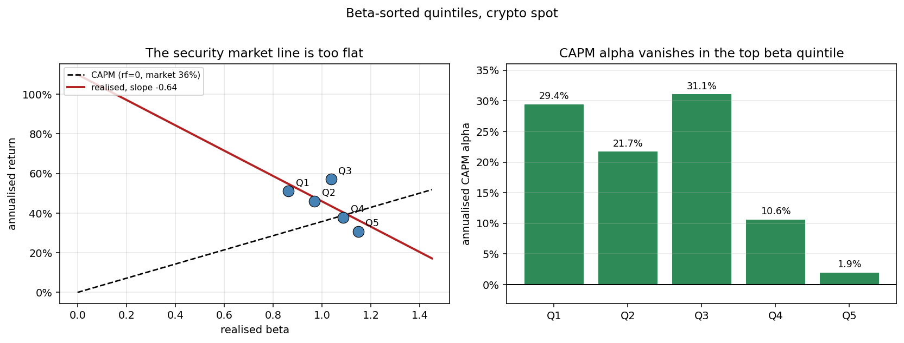
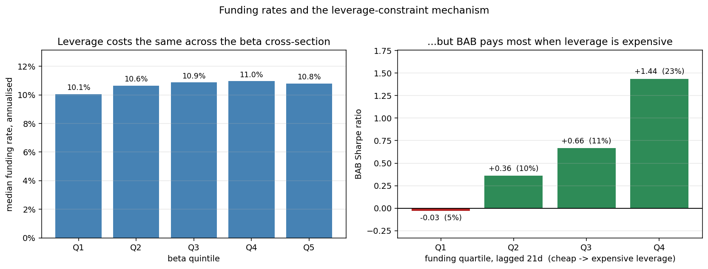
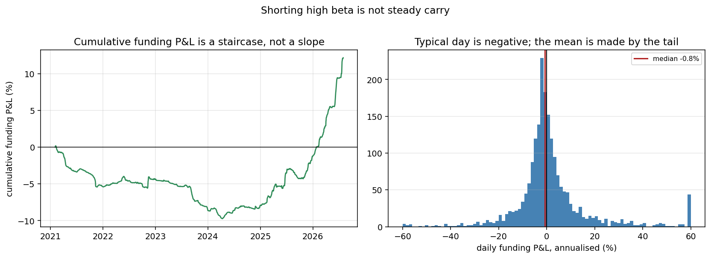

# Results log

Appended by `results.py` as the analysis runs. Newest entries at the bottom.

---

## shrinkage robustness

*2026-09-06 17:28*

Residual market beta of the BAB factor declines monotonically with shrinkage and crosses zero at Frazzini-Pedersen's constant w = 0.6, which was chosen ex ante on US equities rather than fitted here. The Vasicek closed form gives w ~ 0.89, which under-shrinks: crypto betas mean-revert out of sample more than the OLS sampling-variance approximation implies. Beta-neutrality costs alpha (26.0% -> 18.4%, t 2.26 -> 1.72) because the under-shrunk version was collecting part of its return from an unintended long-market tilt.

| shrinkage            |   realised_beta |   t_beta |   alpha_ann |   t_alpha |   sharpe |   ann_vol |
|:---------------------|----------------:|---------:|------------:|----------:|---------:|----------:|
| no shrinkage (w=1.0) |          0.3240 |  10.5396 |      0.2641 |    2.1910 |   0.8141 |    0.3885 |
| Vasicek (w~0.89)     |          0.2218 |   8.1108 |      0.2599 |    2.2643 |   0.8693 |    0.3401 |
| FP constant (w=0.6)  |          0.0366 |   1.6090 |      0.1844 |    1.7195 |   0.6732 |    0.2827 |
| over-shrunk (w=0.4)  |         -0.0925 |  -4.2378 |      0.1562 |    1.4772 |   0.4943 |    0.2859 |

---

## shrinkage robustness

*2026-09-06 17:44*

Residual market beta falls monotonically with shrinkage and crosses zero at Frazzini-Pedersen's w = 0.6 -- chosen ex ante on US equities, not fitted here. The Vasicek closed form gives w ~ 0.89, which under-shrinks: crypto betas mean-revert out of sample more than the OLS sampling-variance approximation implies. Beta-neutrality costs alpha, because the under-shrunk version was collecting part of its return from an unintended long-market tilt.

| shrinkage            |   realised_beta |   t_beta |   alpha_ann |   t_alpha |   sharpe |   ann_vol |     n_obs |
|:---------------------|----------------:|---------:|------------:|----------:|---------:|----------:|----------:|
| no shrinkage (w=1.0) |          0.2571 |   9.2338 |      0.2012 |    1.8409 |   0.7046 |    0.3444 | 3074.0000 |
| Vasicek (w~0.89)     |          0.1817 |   7.0728 |      0.2136 |    2.0144 |   0.7728 |    0.3143 | 3074.0000 |
| FP constant (w=0.6)  |          0.0048 |   0.2214 |      0.1431 |    1.3888 |   0.5217 |    0.2757 | 3074.0000 |
| over-shrunk (w=0.4)  |         -0.1141 |  -5.4107 |      0.1200 |    1.1578 |   0.3515 |    0.2891 | 3074.0000 |

---

## shrinkage robustness

*2026-09-06 17:49*

Residual market beta falls monotonically with shrinkage and crosses zero at Frazzini-Pedersen's w = 0.6 -- chosen ex ante on US equities, not fitted here. The Vasicek closed form gives w ~ 0.89, which under-shrinks: crypto betas mean-revert out of sample more than the OLS sampling-variance approximation implies. Beta-neutrality costs alpha, because the under-shrunk version was collecting part of its return from an unintended long-market tilt.

| shrinkage            |   realised_beta |   t_beta |   alpha_ann |   t_alpha |   sharpe |   ann_vol |     n_obs |
|:---------------------|----------------:|---------:|------------:|----------:|---------:|----------:|----------:|
| no shrinkage (w=1.0) |          0.2571 |   9.2338 |      0.2012 |    1.8409 |   0.7046 |    0.3444 | 3074.0000 |
| Vasicek (w~0.89)     |          0.1817 |   7.0728 |      0.2136 |    2.0144 |   0.7728 |    0.3143 | 3074.0000 |
| FP constant (w=0.6)  |          0.0048 |   0.2214 |      0.1431 |    1.3888 |   0.5217 |    0.2757 | 3074.0000 |
| over-shrunk (w=0.4)  |         -0.1141 |  -5.4107 |      0.1200 |    1.1578 |   0.3515 |    0.2891 | 3074.0000 |

---

## shrinkage robustness

*2026-09-06 18:01*

Residual market beta falls monotonically with shrinkage and crosses zero at Frazzini-Pedersen's w = 0.6 -- chosen ex ante on US equities, not fitted here. The Vasicek closed form gives w ~ 0.89, which under-shrinks: crypto betas mean-revert out of sample more than the OLS sampling-variance approximation implies. Beta-neutrality costs alpha, because the under-shrunk version was collecting part of its return from an unintended long-market tilt.

| shrinkage            |   realised_beta |   t_beta |   alpha_ann |   t_alpha |   sharpe |   ann_vol |     n_obs |
|:---------------------|----------------:|---------:|------------:|----------:|---------:|----------:|----------:|
| no shrinkage (w=1.0) |          0.2571 |   9.2338 |      0.2012 |    1.8409 |   0.7046 |    0.3444 | 3074.0000 |
| Vasicek (w~0.89)     |          0.1817 |   7.0728 |      0.2136 |    2.0144 |   0.7728 |    0.3143 | 3074.0000 |
| FP constant (w=0.6)  |          0.0048 |   0.2214 |      0.1431 |    1.3888 |   0.5217 |    0.2757 | 3074.0000 |
| over-shrunk (w=0.4)  |         -0.1141 |  -5.4107 |      0.1200 |    1.1578 |   0.3515 |    0.2891 | 3074.0000 |

---

## security market line

*2026-09-06 18:11*

Realised SML slope is -0.10 against a CAPM prediction of 0.28. CAPM alpha falls from 15.9% in Q1 to -0.7% in Q5, and Sharpe declines monotonically (0.52 to 0.21). This is the flat-SML fact BAB is built to exploit.

---

## beta quintiles

*2026-09-06 18:11*

Beta-sorted quintile portfolios, equal weighted, rebalanced daily.

|    |   beta |   ann_ret |   sharpe |   alpha |
|:---|-------:|----------:|---------:|--------:|
| Q1 | 0.7240 |    0.2961 |   0.5237 |  0.1588 |
| Q2 | 1.0501 |    0.3743 |   0.4730 |  0.1909 |
| Q3 | 1.1144 |    0.3489 |   0.4127 |  0.1548 |
| Q4 | 1.1829 |    0.2992 |   0.3382 |  0.0927 |
| Q5 | 1.2416 |    0.1931 |   0.2052 | -0.0069 |

---

## funding and leverage

*2026-09-06 18:11*

Left: median funding is ~10% annualised in every beta quintile, so leverage demand is NOT concentrated in high-beta coins -- the cross-sectional reading of the FP mechanism does not hold here. Right: sorting days by aggregate funding lagged 21 days, BAB's Sharpe rises monotonically from ~0 when leverage is cheap (5% ann) to ~1.4 when it is expensive (23% ann). Regressing BAB on lagged aggregate funding gives t = 2.78. This is the crypto analogue of FP's TED-spread test, using an observed price of leverage rather than a proxy.

---

## security market line

*2026-09-06 18:12*

Realised SML slope is -0.10 against a CAPM prediction of 0.28. CAPM alpha falls from 15.9% in Q1 to -0.7% in Q5, and Sharpe declines monotonically (0.52 to 0.21). This is the flat-SML fact BAB is built to exploit.

---

## beta quintiles

*2026-09-06 18:12*

Beta-sorted quintile portfolios, equal weighted, rebalanced daily.

|    |   beta |   ann_ret |   sharpe |   alpha |
|:---|-------:|----------:|---------:|--------:|
| Q1 | 0.7240 |    0.2961 |   0.5237 |  0.1588 |
| Q2 | 1.0501 |    0.3743 |   0.4730 |  0.1909 |
| Q3 | 1.1144 |    0.3489 |   0.4127 |  0.1548 |
| Q4 | 1.1829 |    0.2992 |   0.3382 |  0.0927 |
| Q5 | 1.2416 |    0.1931 |   0.2052 | -0.0069 |

---

## funding and leverage

*2026-09-06 18:12*

Left: median funding is ~10% annualised in every beta quintile, so leverage demand is NOT concentrated in high-beta coins -- the cross-sectional reading of the FP mechanism does not hold here. Right: sorting days by aggregate funding lagged 21 days, BAB's Sharpe rises monotonically from ~0 when leverage is cheap (5% ann) to ~1.4 when it is expensive (23% ann). Regressing BAB on lagged aggregate funding gives t = 2.78. This is the crypto analogue of FP's TED-spread test, using an observed price of leverage rather than a proxy.

---

## security market line

*2026-09-06 18:20*

Realised SML slope is -0.10 against a CAPM prediction of 0.28. CAPM alpha falls from 15.9% in Q1 to -0.7% in Q5, and Sharpe declines monotonically (0.52 to 0.21). This is the flat-SML fact BAB is built to exploit.

---

## beta quintiles

*2026-09-06 18:20*

Beta-sorted quintile portfolios, equal weighted, rebalanced daily.

|    |   beta |   ann_ret |   sharpe |   alpha |
|:---|-------:|----------:|---------:|--------:|
| Q1 | 0.7240 |    0.2961 |   0.5237 |  0.1588 |
| Q2 | 1.0501 |    0.3743 |   0.4730 |  0.1909 |
| Q3 | 1.1144 |    0.3489 |   0.4127 |  0.1548 |
| Q4 | 1.1829 |    0.2992 |   0.3382 |  0.0927 |
| Q5 | 1.2416 |    0.1931 |   0.2052 | -0.0069 |

---

## funding and leverage

*2026-09-06 18:20*

Left: median funding is ~10% annualised in every beta quintile, so leverage demand is NOT concentrated in high-beta coins -- the cross-sectional reading of the FP mechanism does not hold here. Right: sorting days by aggregate funding lagged 21 days, BAB's Sharpe rises monotonically from ~0 when leverage is cheap (5% ann) to ~1.4 when it is expensive (23% ann). Regressing BAB on lagged aggregate funding gives t = 2.78. This is the crypto analogue of FP's TED-spread test, using an observed price of leverage rather than a proxy.

---

## shrinkage robustness

*2026-09-06 18:58*

Residual market beta falls monotonically with shrinkage and crosses zero at Frazzini-Pedersen's w = 0.6 -- chosen ex ante on US equities, not fitted here. The Vasicek closed form gives w ~ 0.89, which under-shrinks: crypto betas mean-revert out of sample more than the OLS sampling-variance approximation implies. Beta-neutrality costs alpha, because the under-shrunk version was collecting part of its return from an unintended long-market tilt.

| shrinkage            |   realised_beta |   t_beta |   alpha_ann |   t_alpha |   sharpe |   ann_vol |     n_obs |
|:---------------------|----------------:|---------:|------------:|----------:|---------:|----------:|----------:|
| no shrinkage (w=1.0) |          0.2502 |   9.9433 |      0.2048 |    1.8024 |   0.6801 |    0.3603 | 3074.0000 |
| Vasicek (w~0.89)     |          0.1368 |   6.5182 |      0.1989 |    1.8321 |   0.7116 |    0.3104 | 3074.0000 |
| FP constant (w=0.6)  |          0.0735 |   3.3206 |      0.1901 |    1.7650 |   0.6787 |    0.2975 | 3074.0000 |
| over-shrunk (w=0.4)  |         -0.0140 |  -0.6495 |      0.1829 |    1.7113 |   0.6185 |    0.2920 | 3074.0000 |

---

## shrinkage robustness

*2026-09-06 19:30*

Residual market beta falls monotonically with shrinkage and crosses zero at Frazzini-Pedersen's w = 0.6 -- chosen ex ante on US equities, not fitted here. The Vasicek closed form gives w ~ 0.89, which under-shrinks: crypto betas mean-revert out of sample more than the OLS sampling-variance approximation implies. Beta-neutrality costs alpha, because the under-shrunk version was collecting part of its return from an unintended long-market tilt.

| shrinkage            |   realised_beta |   t_beta |   alpha_ann |   t_alpha |   sharpe |   ann_vol |     n_obs |
|:---------------------|----------------:|---------:|------------:|----------:|---------:|----------:|----------:|
| no shrinkage (w=1.0) |          0.2502 |   9.9381 |      0.2036 |    1.7885 |   0.6758 |    0.3608 | 3074.0000 |
| Vasicek (w~0.89)     |          0.1367 |   6.5045 |      0.1978 |    1.8185 |   0.7071 |    0.3108 | 3074.0000 |
| FP constant (w=0.6)  |          0.0739 |   3.3407 |      0.1889 |    1.7519 |   0.6742 |    0.2978 | 3074.0000 |
| over-shrunk (w=0.4)  |         -0.0135 |  -0.6277 |      0.1816 |    1.6989 |   0.6145 |    0.2921 | 3074.0000 |

---

## strategy waterfall

*2026-09-06 19:39*

BAB rebuilt on perpetual futures, 2021 onward, adding one real-world constraint per row. Costs are close to a wash: 20bps execution on 10.8x annual turnover takes about 2.2%/yr, and net funding returns about the same. The strategy survives, at roughly half the factor Sharpe.

| strategy                  |   ann_ret |   ann_vol |   sharpe |   max_dd |
|:--------------------------|----------:|----------:|---------:|---------:|
| 1. gross (perp returns)   |    0.0978 |    0.2574 |   0.3799 |  -0.5164 |
| 2. less funding           |    0.1199 |    0.2581 |   0.4647 |  -0.5226 |
| 3. less execution @ 7bps  |    0.1123 |    0.2581 |   0.4350 |  -0.5283 |
| 4. less execution @ 20bps |    0.0981 |    0.2582 |   0.3799 |  -0.5536 |
| 5. less delisting exits   |    0.0947 |    0.2582 |   0.3667 |  -0.5569 |

---

## funding pnl decomposition

*2026-09-06 19:39*

The long low-beta leg pays -2.30%/yr of funding and the short high-beta leg earns +4.52%/yr, netting +2.21%/yr. But the median day LOSES funding and only ~44% of days are positive: about 60% of the total comes from the best 1% of days. This is not carry, it is a fat right tail that pays during leverage squeezes, when funding on crowded high-beta longs spikes. It is the same phenomenon as the time-series result that BAB earns most when leverage is expensive, showing up in cash flows rather than in returns.

---

## strategy liquidity sensitivity

*2026-09-06 19:39*

Net-of-everything performance against the trailing-volume screen. Performance IMPROVES as the universe is restricted to more liquid coins -- Sharpe roughly doubles between the $1m and $20m thresholds. That is the opposite of the usual anomaly pattern, where returns concentrate in illiquid names and vanish once costs are applied. The chosen $5m threshold is therefore conservative.

| strategy     |   ann_ret |   ann_vol |   sharpe |   max_dd |   coins_per_day |
|:-------------|----------:|----------:|---------:|---------:|----------------:|
| $1,000,000   |    0.0879 |    0.2446 |   0.3595 |  -0.5669 |        189.0824 |
| $5,000,000   |    0.0947 |    0.2582 |   0.3667 |  -0.5569 |        149.8503 |
| $20,000,000  |    0.1639 |    0.2883 |   0.5686 |  -0.4999 |         86.5545 |
| $50,000,000  |    0.1825 |    0.3299 |   0.5532 |  -0.5946 |         48.8204 |
| $100,000,000 |    0.4158 |    0.3828 |   1.0863 |  -0.5979 |         29.9912 |

---

## strategy leverage sensitivity

*2026-09-06 19:39*

Leverage caps barely bind: gross notional averages 1.94x, so a 3x cap does nothing and even 1.5x costs little Sharpe. BAB in crypto does not need much leverage, because the beta spread is wide enough that the low-beta leg needs little scaling.

| strategy   |   ann_ret |   ann_vol |   sharpe |   max_dd |
|:-----------|----------:|----------:|---------:|---------:|
| uncapped   |    0.0947 |    0.2582 |   0.3667 |  -0.5569 |
| cap 3.0x   |    0.0947 |    0.2582 |   0.3667 |  -0.5569 |
| cap 2.0x   |    0.0899 |    0.2554 |   0.3521 |  -0.5585 |
| cap 1.5x   |    0.0736 |    0.2005 |   0.3672 |  -0.4308 |
| cap 1.0x   |    0.0494 |    0.1338 |   0.3692 |  -0.2882 |

---

## strategy waterfall

*2026-09-06 19:52*

BAB rebuilt on perpetual futures, 2021 onward, adding one real-world constraint per row. Costs are close to a wash: 20bps execution on 10.8x annual turnover takes about 2.2%/yr, and net funding returns about the same. The strategy survives, at roughly half the factor Sharpe.

| strategy                  |   ann_ret |   ann_vol |   sharpe |   max_dd |
|:--------------------------|----------:|----------:|---------:|---------:|
| 1. gross (perp returns)   |    0.0978 |    0.2574 |   0.3799 |  -0.5164 |
| 2. less funding           |    0.1199 |    0.2581 |   0.4647 |  -0.5226 |
| 3. less execution @ 7bps  |    0.1123 |    0.2581 |   0.4350 |  -0.5283 |
| 4. less execution @ 20bps |    0.0981 |    0.2582 |   0.3799 |  -0.5536 |
| 5. less delisting exits   |    0.0947 |    0.2582 |   0.3667 |  -0.5569 |

---

## funding pnl decomposition

*2026-09-06 19:53*

The long low-beta leg pays -2.30%/yr of funding and the short high-beta leg earns +4.52%/yr, netting +2.21%/yr. But the median day LOSES funding and only ~44% of days are positive: about 60% of the total comes from the best 1% of days. This is not carry, it is a fat right tail that pays during leverage squeezes, when funding on crowded high-beta longs spikes. It is the same phenomenon as the time-series result that BAB earns most when leverage is expensive, showing up in cash flows rather than in returns.

---

## strategy liquidity sensitivity

*2026-09-06 19:53*

Net-of-everything performance against the trailing-volume screen. Performance IMPROVES as the universe is restricted to more liquid coins -- Sharpe roughly doubles between the $1m and $20m thresholds. That is the opposite of the usual anomaly pattern, where returns concentrate in illiquid names and vanish once costs are applied. The chosen $5m threshold is therefore conservative.

| strategy     |   ann_ret |   ann_vol |   sharpe |   max_dd |   coins_per_day |
|:-------------|----------:|----------:|---------:|---------:|----------------:|
| $1,000,000   |    0.0879 |    0.2446 |   0.3595 |  -0.5669 |        189.0824 |
| $5,000,000   |    0.0947 |    0.2582 |   0.3667 |  -0.5569 |        149.8503 |
| $20,000,000  |    0.1639 |    0.2883 |   0.5686 |  -0.4999 |         86.5545 |
| $50,000,000  |    0.1825 |    0.3299 |   0.5532 |  -0.5946 |         48.8204 |
| $100,000,000 |    0.4158 |    0.3828 |   1.0863 |  -0.5979 |         29.9912 |

---

## strategy leverage sensitivity

*2026-09-06 19:53*

Leverage caps barely bind: gross notional averages 1.94x, so a 3x cap does nothing and even 1.5x costs little Sharpe. BAB in crypto does not need much leverage, because the beta spread is wide enough that the low-beta leg needs little scaling.

| strategy   |   ann_ret |   ann_vol |   sharpe |   max_dd |
|:-----------|----------:|----------:|---------:|---------:|
| uncapped   |    0.0947 |    0.2582 |   0.3667 |  -0.5569 |
| cap 3.0x   |    0.0947 |    0.2582 |   0.3667 |  -0.5569 |
| cap 2.0x   |    0.0899 |    0.2554 |   0.3521 |  -0.5585 |
| cap 1.5x   |    0.0736 |    0.2005 |   0.3672 |  -0.4308 |
| cap 1.0x   |    0.0494 |    0.1338 |   0.3692 |  -0.2882 |

---

## strategy waterfall

*2026-09-06 20:02*

BAB rebuilt on perpetual futures, 2021 onward, adding one real-world constraint per row. Costs are close to a wash: 20bps execution on 10.8x annual turnover takes about 2.2%/yr, and net funding returns about the same. The strategy survives, at roughly half the factor Sharpe.

| strategy                  |   ann_ret |   ann_vol |   sharpe |   max_dd |
|:--------------------------|----------:|----------:|---------:|---------:|
| 1. gross (perp returns)   |    0.0978 |    0.2574 |   0.3799 |  -0.5164 |
| 2. less funding           |    0.1199 |    0.2581 |   0.4647 |  -0.5226 |
| 3. less execution @ 7bps  |    0.1123 |    0.2581 |   0.4350 |  -0.5283 |
| 4. less execution @ 20bps |    0.0981 |    0.2582 |   0.3799 |  -0.5536 |
| 5. less delisting exits   |    0.0947 |    0.2582 |   0.3667 |  -0.5569 |

---

## funding pnl decomposition

*2026-09-06 20:02*

The long low-beta leg pays -2.30%/yr of funding and the short high-beta leg earns +4.52%/yr, netting +2.21%/yr. But the median day LOSES funding and only ~44% of days are positive: about 60% of the total comes from the best 1% of days. This is not carry, it is a fat right tail that pays during leverage squeezes, when funding on crowded high-beta longs spikes. It is the same phenomenon as the time-series result that BAB earns most when leverage is expensive, showing up in cash flows rather than in returns.

---

## strategy liquidity sensitivity

*2026-09-06 20:02*

Net-of-everything performance against the trailing-volume screen. Performance IMPROVES as the universe is restricted to more liquid coins -- Sharpe roughly doubles between the $1m and $20m thresholds. That is the opposite of the usual anomaly pattern, where returns concentrate in illiquid names and vanish once costs are applied. The chosen $5m threshold is therefore conservative.

| strategy     |   ann_ret |   ann_vol |   sharpe |   max_dd |   coins_per_day |
|:-------------|----------:|----------:|---------:|---------:|----------------:|
| $1,000,000   |    0.0879 |    0.2446 |   0.3595 |  -0.5669 |        189.0824 |
| $5,000,000   |    0.0947 |    0.2582 |   0.3667 |  -0.5569 |        149.8503 |
| $20,000,000  |    0.1639 |    0.2883 |   0.5686 |  -0.4999 |         86.5545 |
| $50,000,000  |    0.1825 |    0.3299 |   0.5532 |  -0.5946 |         48.8204 |
| $100,000,000 |    0.4158 |    0.3828 |   1.0863 |  -0.5979 |         29.9912 |

---

## strategy leverage sensitivity

*2026-09-06 20:02*

Leverage caps barely bind: gross notional averages 1.94x, so a 3x cap does nothing and even 1.5x costs little Sharpe. BAB in crypto does not need much leverage, because the beta spread is wide enough that the low-beta leg needs little scaling.

| strategy   |   ann_ret |   ann_vol |   sharpe |   max_dd |
|:-----------|----------:|----------:|---------:|---------:|
| uncapped   |    0.0947 |    0.2582 |   0.3667 |  -0.5569 |
| cap 3.0x   |    0.0947 |    0.2582 |   0.3667 |  -0.5569 |
| cap 2.0x   |    0.0899 |    0.2554 |   0.3521 |  -0.5585 |
| cap 1.5x   |    0.0736 |    0.2005 |   0.3672 |  -0.4308 |
| cap 1.0x   |    0.0494 |    0.1338 |   0.3692 |  -0.2882 |

---

## factor to strategy ladder

*2026-09-06 20:02*

One change per rung from the paper-style factor to the tradeable strategy. The collapse is at C -> C2, restricting to coin-days on which a perpetual actually existed. That step alone costs more Sharpe than costs, funding and the liquidity screen combined. Switching spot returns for perp returns (C2 -> D) costs almost nothing, so this is not about the two return series differing.

| strategy                             |   ann_ret |   ann_vol |   sharpe |   max_dd |
|:-------------------------------------|----------:|----------:|---------:|---------:|
| A. spot factor, 2017+, all 576 coins |    0.2038 |    0.3025 |   0.6736 |  -0.4391 |
| B. spot, 2021+ only                  |    0.2244 |    0.2421 |   0.9268 |  -0.3181 |
| C. spot, 2021+, perp-listed coins    |    0.2624 |    0.2495 |   1.0517 |  -0.3523 |
| C2. same, only days the perp existed |    0.1154 |    0.2616 |   0.4411 |  -0.5503 |
| D. perp returns instead of spot      |    0.1125 |    0.2619 |   0.4295 |  -0.5308 |
| E. + $5m liquidity screen            |    0.0978 |    0.2574 |   0.3799 |  -0.5164 |
| F. - funding                         |    0.1199 |    0.2581 |   0.4647 |  -0.5226 |
| G. - costs and delisting             |    0.0947 |    0.2582 |   0.3667 |  -0.5569 |

---

## pre listing selection

*2026-09-06 20:02*

93,243 coin-days (19.1% of the spot sample) sit in the universe of perp-listed coins but before their perp existed; 82% of those are pre-listing. They average +69%/yr against -9%/yr for perp-listed days, and carry slightly LOWER beta, so they land in the long leg. A coin earns its perp listing by first becoming large and popular, so selecting on eventual listing selects on a past run-up. This is the single largest reason the tradeable strategy underperforms the factor -- not transaction costs.

---

## beta quality by liquidity

*2026-09-06 20:02*

Regression of realised 90-day-forward beta on the estimate, by trailing perp volume. Both the correlation and the attenuation slope rise monotonically with liquidity: an illiquid coin's estimated beta correlates 0.25 with the beta it goes on to realise, against 0.48 for a liquid one, and the slope rises from 0.45 to 0.78. Betas in illiquid names are largely noise, so those coins are sorted into the wrong quintiles and dilute the spread. The liquidity screen is therefore a signal-quality filter, not only a tradeability one. Note the slope is below 1 even for liquid coins, which is the general case for shrinkage.

| liquidity       |         n |   corr_est_fwd |   slope |
|:----------------|----------:|---------------:|--------:|
| illiquid (<$2m) |  686.0000 |         0.2451 |  0.4527 |
| mid ($2-20m)    | 5588.0000 |         0.3709 |  0.6733 |
| liquid (>$20m)  | 5577.0000 |         0.4777 |  0.7842 |

---

## strategy waterfall

*2026-09-06 20:09*

BAB rebuilt on perpetual futures, 2021 onward, adding one real-world constraint per row. Costs are close to a wash: 20bps execution on 10.8x annual turnover takes about 2.2%/yr, and net funding returns about the same. The strategy survives, at roughly half the factor Sharpe.

| strategy                  |   ann_ret |   ann_vol |   sharpe |   max_dd |
|:--------------------------|----------:|----------:|---------:|---------:|
| 1. gross (perp returns)   |    0.0978 |    0.2574 |   0.3799 |  -0.5164 |
| 2. less funding           |    0.1199 |    0.2581 |   0.4647 |  -0.5226 |
| 3. less execution @ 7bps  |    0.1123 |    0.2581 |   0.4350 |  -0.5283 |
| 4. less execution @ 20bps |    0.0981 |    0.2582 |   0.3799 |  -0.5536 |
| 5. less delisting exits   |    0.0947 |    0.2582 |   0.3667 |  -0.5569 |

---

## funding pnl decomposition

*2026-09-06 20:09*

The long low-beta leg pays -2.30%/yr of funding and the short high-beta leg earns +4.52%/yr, netting +2.21%/yr. But the median day LOSES funding and only ~44% of days are positive: about 60% of the total comes from the best 1% of days. This is not carry, it is a fat right tail that pays during leverage squeezes, when funding on crowded high-beta longs spikes. It is the same phenomenon as the time-series result that BAB earns most when leverage is expensive, showing up in cash flows rather than in returns.

---

## strategy liquidity sensitivity

*2026-09-06 20:09*

Net-of-everything performance against the trailing-volume screen. Performance IMPROVES as the universe is restricted to more liquid coins -- Sharpe roughly doubles between the $1m and $20m thresholds. That is the opposite of the usual anomaly pattern, where returns concentrate in illiquid names and vanish once costs are applied. The chosen $5m threshold is therefore conservative.

| strategy     |   ann_ret |   ann_vol |   sharpe |   max_dd |   coins_per_day |
|:-------------|----------:|----------:|---------:|---------:|----------------:|
| $1,000,000   |    0.0879 |    0.2446 |   0.3595 |  -0.5669 |        189.0824 |
| $5,000,000   |    0.0947 |    0.2582 |   0.3667 |  -0.5569 |        149.8503 |
| $20,000,000  |    0.1639 |    0.2883 |   0.5686 |  -0.4999 |         86.5545 |
| $50,000,000  |    0.1825 |    0.3299 |   0.5532 |  -0.5946 |         48.8204 |
| $100,000,000 |    0.4158 |    0.3828 |   1.0863 |  -0.5979 |         29.9912 |

---

## strategy leverage sensitivity

*2026-09-06 20:09*

Leverage caps barely bind: gross notional averages 1.94x, so a 3x cap does nothing and even 1.5x costs little Sharpe. BAB in crypto does not need much leverage, because the beta spread is wide enough that the low-beta leg needs little scaling.

| strategy   |   ann_ret |   ann_vol |   sharpe |   max_dd |
|:-----------|----------:|----------:|---------:|---------:|
| uncapped   |    0.0947 |    0.2582 |   0.3667 |  -0.5569 |
| cap 3.0x   |    0.0947 |    0.2582 |   0.3667 |  -0.5569 |
| cap 2.0x   |    0.0899 |    0.2554 |   0.3521 |  -0.5585 |
| cap 1.5x   |    0.0736 |    0.2005 |   0.3672 |  -0.4308 |
| cap 1.0x   |    0.0494 |    0.1338 |   0.3692 |  -0.2882 |

---

## factor to strategy ladder

*2026-09-06 20:09*

One change per rung from the paper-style factor to the tradeable strategy. The collapse is at C -> C2, restricting to coin-days on which a perpetual actually existed. That step alone costs more Sharpe than costs, funding and the liquidity screen combined. Switching spot returns for perp returns (C2 -> D) costs almost nothing, so this is not about the two return series differing.

| strategy                             |   ann_ret |   ann_vol |   sharpe |   max_dd |
|:-------------------------------------|----------:|----------:|---------:|---------:|
| A. spot factor, 2017+, all 576 coins |    0.2038 |    0.3025 |   0.6736 |  -0.4391 |
| B. spot, 2021+ only                  |    0.2244 |    0.2421 |   0.9268 |  -0.3181 |
| C. spot, 2021+, perp-listed coins    |    0.2624 |    0.2495 |   1.0517 |  -0.3523 |
| C2. same, only days the perp existed |    0.1154 |    0.2616 |   0.4411 |  -0.5503 |
| D. perp returns instead of spot      |    0.1125 |    0.2619 |   0.4295 |  -0.5308 |
| E. + $5m liquidity screen            |    0.0978 |    0.2574 |   0.3799 |  -0.5164 |
| F. - funding                         |    0.1199 |    0.2581 |   0.4647 |  -0.5226 |
| G. - costs and delisting             |    0.0947 |    0.2582 |   0.3667 |  -0.5569 |

---

## pre listing selection

*2026-09-06 20:09*

93,243 coin-days (19.1% of the spot sample) sit in the universe of perp-listed coins but before their perp existed; 82% of those are pre-listing. They average +69%/yr against -9%/yr for perp-listed days, and carry slightly LOWER beta, so they land in the long leg. A coin earns its perp listing by first becoming large and popular, so selecting on eventual listing selects on a past run-up. This is the single largest reason the tradeable strategy underperforms the factor -- not transaction costs.

---

## strategy waterfall

*2026-09-06 20:10*

BAB rebuilt on perpetual futures, 2021 onward, adding one real-world constraint per row. Costs are close to a wash: 20bps execution on 10.8x annual turnover takes about 2.2%/yr, and net funding returns about the same. The strategy survives, at roughly half the factor Sharpe.

| strategy                  |   ann_ret |   ann_vol |   sharpe |   max_dd |
|:--------------------------|----------:|----------:|---------:|---------:|
| 1. gross (perp returns)   |    0.0978 |    0.2574 |   0.3799 |  -0.5164 |
| 2. less funding           |    0.1199 |    0.2581 |   0.4647 |  -0.5226 |
| 3. less execution @ 7bps  |    0.1123 |    0.2581 |   0.4350 |  -0.5283 |
| 4. less execution @ 20bps |    0.0981 |    0.2582 |   0.3799 |  -0.5536 |
| 5. less delisting exits   |    0.0947 |    0.2582 |   0.3667 |  -0.5569 |

---

## funding pnl decomposition

*2026-09-06 20:10*

The long low-beta leg pays -2.30%/yr of funding and the short high-beta leg earns +4.52%/yr, netting +2.21%/yr. But the median day LOSES funding and only ~44% of days are positive: about 60% of the total comes from the best 1% of days. This is not carry, it is a fat right tail that pays during leverage squeezes, when funding on crowded high-beta longs spikes. It is the same phenomenon as the time-series result that BAB earns most when leverage is expensive, showing up in cash flows rather than in returns.

---

## strategy liquidity sensitivity

*2026-09-06 20:10*

Net-of-everything performance against the trailing-volume screen. Performance IMPROVES as the universe is restricted to more liquid coins -- Sharpe roughly doubles between the $1m and $20m thresholds. That is the opposite of the usual anomaly pattern, where returns concentrate in illiquid names and vanish once costs are applied. The chosen $5m threshold is therefore conservative.

| strategy     |   ann_ret |   ann_vol |   sharpe |   max_dd |   coins_per_day |
|:-------------|----------:|----------:|---------:|---------:|----------------:|
| $1,000,000   |    0.0879 |    0.2446 |   0.3595 |  -0.5669 |        189.0824 |
| $5,000,000   |    0.0947 |    0.2582 |   0.3667 |  -0.5569 |        149.8503 |
| $20,000,000  |    0.1639 |    0.2883 |   0.5686 |  -0.4999 |         86.5545 |
| $50,000,000  |    0.1825 |    0.3299 |   0.5532 |  -0.5946 |         48.8204 |
| $100,000,000 |    0.4158 |    0.3828 |   1.0863 |  -0.5979 |         29.9912 |

---

## strategy leverage sensitivity

*2026-09-06 20:10*

Leverage caps barely bind: gross notional averages 1.94x, so a 3x cap does nothing and even 1.5x costs little Sharpe. BAB in crypto does not need much leverage, because the beta spread is wide enough that the low-beta leg needs little scaling.

| strategy   |   ann_ret |   ann_vol |   sharpe |   max_dd |
|:-----------|----------:|----------:|---------:|---------:|
| uncapped   |    0.0947 |    0.2582 |   0.3667 |  -0.5569 |
| cap 3.0x   |    0.0947 |    0.2582 |   0.3667 |  -0.5569 |
| cap 2.0x   |    0.0899 |    0.2554 |   0.3521 |  -0.5585 |
| cap 1.5x   |    0.0736 |    0.2005 |   0.3672 |  -0.4308 |
| cap 1.0x   |    0.0494 |    0.1338 |   0.3692 |  -0.2882 |

---

## factor to strategy ladder

*2026-09-06 20:10*

One change per rung from the paper-style factor to the tradeable strategy. The collapse is at C -> C2, restricting to coin-days on which a perpetual actually existed. That step alone costs more Sharpe than costs, funding and the liquidity screen combined. Switching spot returns for perp returns (C2 -> D) costs almost nothing, so this is not about the two return series differing.

| strategy                             |   ann_ret |   ann_vol |   sharpe |   max_dd |
|:-------------------------------------|----------:|----------:|---------:|---------:|
| A. spot factor, 2017+, all 576 coins |    0.2038 |    0.3025 |   0.6736 |  -0.4391 |
| B. spot, 2021+ only                  |    0.2244 |    0.2421 |   0.9268 |  -0.3181 |
| C. spot, 2021+, perp-listed coins    |    0.2624 |    0.2495 |   1.0517 |  -0.3523 |
| C2. same, only days the perp existed |    0.1154 |    0.2616 |   0.4411 |  -0.5503 |
| D. perp returns instead of spot      |    0.1125 |    0.2619 |   0.4295 |  -0.5308 |
| E. + $5m liquidity screen            |    0.0978 |    0.2574 |   0.3799 |  -0.5164 |
| F. - funding                         |    0.1199 |    0.2581 |   0.4647 |  -0.5226 |
| G. - costs and delisting             |    0.0947 |    0.2582 |   0.3667 |  -0.5569 |

---

## pre listing selection

*2026-09-06 20:10*

93,243 coin-days (19.1% of the spot sample) sit in the universe of perp-listed coins but before their perp existed; 82% of those are pre-listing. They average +69%/yr against -9%/yr for perp-listed days, and carry slightly LOWER beta, so they land in the long leg. A coin earns its perp listing by first becoming large and popular, so selecting on eventual listing selects on a past run-up. This is the single largest reason the tradeable strategy underperforms the factor -- not transaction costs.

---

## beta quality by liquidity

*2026-09-06 20:10*

Regression of realised 90-day-forward beta on the estimate, by trailing perp volume. Both the correlation and the attenuation slope rise monotonically with liquidity: an illiquid coin's estimated beta correlates 0.25 with the beta it goes on to realise, against 0.48 for a liquid one, and the slope rises from 0.45 to 0.78. Betas in illiquid names are largely noise, so those coins are sorted into the wrong quintiles and dilute the spread. The liquidity screen is therefore a signal-quality filter, not only a tradeability one. Note the slope is below 1 even for liquid coins, which is the general case for shrinkage.

| liquidity       |         n |   corr_est_fwd |   slope |
|:----------------|----------:|---------------:|--------:|
| illiquid (<$2m) |  686.0000 |         0.2451 |  0.4527 |
| mid ($2-20m)    | 5588.0000 |         0.3709 |  0.6733 |
| liquid (>$20m)  | 5577.0000 |         0.4777 |  0.7842 |

---

## strategy waterfall

*2026-09-06 20:11*

BAB rebuilt on perpetual futures, 2021 onward, adding one real-world constraint per row. Costs are close to a wash: 20bps execution on 10.8x annual turnover takes about 2.2%/yr, and net funding returns about the same. The strategy survives, at roughly half the factor Sharpe.

| strategy                  |   ann_ret |   ann_vol |   sharpe |   max_dd |
|:--------------------------|----------:|----------:|---------:|---------:|
| 1. gross (perp returns)   |    0.0978 |    0.2574 |   0.3799 |  -0.5164 |
| 2. less funding           |    0.1199 |    0.2581 |   0.4647 |  -0.5226 |
| 3. less execution @ 7bps  |    0.1123 |    0.2581 |   0.4350 |  -0.5283 |
| 4. less execution @ 20bps |    0.0981 |    0.2582 |   0.3799 |  -0.5536 |
| 5. less delisting exits   |    0.0947 |    0.2582 |   0.3667 |  -0.5569 |

---

## funding pnl decomposition

*2026-09-06 20:11*

The long low-beta leg pays -2.30%/yr of funding and the short high-beta leg earns +4.52%/yr, netting +2.21%/yr. But the median day LOSES funding and only ~44% of days are positive: about 60% of the total comes from the best 1% of days. This is not carry, it is a fat right tail that pays during leverage squeezes, when funding on crowded high-beta longs spikes. It is the same phenomenon as the time-series result that BAB earns most when leverage is expensive, showing up in cash flows rather than in returns.

---

## strategy liquidity sensitivity

*2026-09-06 20:11*

Net-of-everything performance against the trailing-volume screen. Performance IMPROVES as the universe is restricted to more liquid coins -- Sharpe roughly doubles between the $1m and $20m thresholds. That is the opposite of the usual anomaly pattern, where returns concentrate in illiquid names and vanish once costs are applied. The chosen $5m threshold is therefore conservative.

| strategy     |   ann_ret |   ann_vol |   sharpe |   max_dd |   coins_per_day |
|:-------------|----------:|----------:|---------:|---------:|----------------:|
| $1,000,000   |    0.0879 |    0.2446 |   0.3595 |  -0.5669 |        189.0824 |
| $5,000,000   |    0.0947 |    0.2582 |   0.3667 |  -0.5569 |        149.8503 |
| $20,000,000  |    0.1639 |    0.2883 |   0.5686 |  -0.4999 |         86.5545 |
| $50,000,000  |    0.1825 |    0.3299 |   0.5532 |  -0.5946 |         48.8204 |
| $100,000,000 |    0.4158 |    0.3828 |   1.0863 |  -0.5979 |         29.9912 |

---

## strategy leverage sensitivity

*2026-09-06 20:11*

Leverage caps barely bind: gross notional averages 1.94x, so a 3x cap does nothing and even 1.5x costs little Sharpe. BAB in crypto does not need much leverage, because the beta spread is wide enough that the low-beta leg needs little scaling.

| strategy   |   ann_ret |   ann_vol |   sharpe |   max_dd |
|:-----------|----------:|----------:|---------:|---------:|
| uncapped   |    0.0947 |    0.2582 |   0.3667 |  -0.5569 |
| cap 3.0x   |    0.0947 |    0.2582 |   0.3667 |  -0.5569 |
| cap 2.0x   |    0.0899 |    0.2554 |   0.3521 |  -0.5585 |
| cap 1.5x   |    0.0736 |    0.2005 |   0.3672 |  -0.4308 |
| cap 1.0x   |    0.0494 |    0.1338 |   0.3692 |  -0.2882 |

---

## factor to strategy ladder

*2026-09-06 20:11*

One change per rung from the paper-style factor to the tradeable strategy. The collapse is at C -> C2, restricting to coin-days on which a perpetual actually existed. That step alone costs more Sharpe than costs, funding and the liquidity screen combined. Switching spot returns for perp returns (C2 -> D) costs almost nothing, so this is not about the two return series differing.

| strategy                             |   ann_ret |   ann_vol |   sharpe |   max_dd |
|:-------------------------------------|----------:|----------:|---------:|---------:|
| A. spot factor, 2017+, all 576 coins |    0.2038 |    0.3025 |   0.6736 |  -0.4391 |
| B. spot, 2021+ only                  |    0.2244 |    0.2421 |   0.9268 |  -0.3181 |
| C. spot, 2021+, perp-listed coins    |    0.2624 |    0.2495 |   1.0517 |  -0.3523 |
| C2. same, only days the perp existed |    0.1154 |    0.2616 |   0.4411 |  -0.5503 |
| D. perp returns instead of spot      |    0.1125 |    0.2619 |   0.4295 |  -0.5308 |
| E. + $5m liquidity screen            |    0.0978 |    0.2574 |   0.3799 |  -0.5164 |
| F. - funding                         |    0.1199 |    0.2581 |   0.4647 |  -0.5226 |
| G. - costs and delisting             |    0.0947 |    0.2582 |   0.3667 |  -0.5569 |

---

## pre listing selection

*2026-09-06 20:11*

93,243 coin-days (19.1% of the spot sample) sit in the universe of perp-listed coins but before their perp existed; 82% of those are pre-listing. They average +69%/yr against -9%/yr for perp-listed days, and carry slightly LOWER beta, so they land in the long leg. A coin earns its perp listing by first becoming large and popular, so selecting on eventual listing selects on a past run-up. This is the single largest reason the tradeable strategy underperforms the factor -- not transaction costs.

---

## beta quality by liquidity

*2026-09-06 20:11*

Regression of realised 90-day-forward beta on the estimate, by trailing perp volume. Both the correlation and the attenuation slope rise monotonically with liquidity: an illiquid coin's estimated beta correlates 0.25 with the beta it goes on to realise, against 0.48 for a liquid one, and the slope rises from 0.45 to 0.78. Betas in illiquid names are largely noise, so those coins are sorted into the wrong quintiles and dilute the spread. The liquidity screen is therefore a signal-quality filter, not only a tradeability one. Note the slope is below 1 even for liquid coins, which is the general case for shrinkage.

| liquidity       |         n |   corr_est_fwd |   slope |
|:----------------|----------:|---------------:|--------:|
| illiquid (<$2m) |  686.0000 |         0.2451 |  0.4527 |
| mid ($2-20m)    | 5588.0000 |         0.3709 |  0.6733 |
| liquid (>$20m)  | 5577.0000 |         0.4777 |  0.7842 |

---

## strategy waterfall

*2026-09-06 20:34*

BAB rebuilt on perpetual futures, 2021 onward, adding one real-world constraint per row. Costs are close to a wash: 20bps execution on 10.8x annual turnover takes about 2.2%/yr, and net funding returns about the same. The strategy survives, at roughly half the factor Sharpe.

| strategy                  |   ann_ret |   ann_vol |   sharpe |   max_dd |
|:--------------------------|----------:|----------:|---------:|---------:|
| 1. gross (perp returns)   |    0.0978 |    0.2574 |   0.3799 |  -0.5164 |
| 2. less funding           |    0.1199 |    0.2581 |   0.4647 |  -0.5226 |
| 3. less execution @ 7bps  |    0.1123 |    0.2581 |   0.4350 |  -0.5283 |
| 4. less execution @ 20bps |    0.0981 |    0.2582 |   0.3799 |  -0.5536 |
| 5. less delisting exits   |    0.0947 |    0.2582 |   0.3667 |  -0.5569 |

---

## funding pnl decomposition

*2026-09-06 20:34*

The long low-beta leg pays -2.30%/yr of funding and the short high-beta leg earns +4.52%/yr, netting +2.21%/yr. But the median day LOSES funding and only ~44% of days are positive: about 60% of the total comes from the best 1% of days. This is not carry, it is a fat right tail that pays during leverage squeezes, when funding on crowded high-beta longs spikes. It is the same phenomenon as the time-series result that BAB earns most when leverage is expensive, showing up in cash flows rather than in returns.

---

## strategy liquidity sensitivity

*2026-09-06 20:34*

Net-of-everything performance against the trailing-volume screen. Performance IMPROVES as the universe is restricted to more liquid coins -- Sharpe roughly doubles between the $1m and $20m thresholds. That is the opposite of the usual anomaly pattern, where returns concentrate in illiquid names and vanish once costs are applied. The chosen $5m threshold is therefore conservative.

| strategy     |   ann_ret |   ann_vol |   sharpe |   max_dd |   coins_per_day |
|:-------------|----------:|----------:|---------:|---------:|----------------:|
| $1,000,000   |    0.0879 |    0.2446 |   0.3595 |  -0.5669 |        189.0824 |
| $5,000,000   |    0.0947 |    0.2582 |   0.3667 |  -0.5569 |        149.8503 |
| $20,000,000  |    0.1639 |    0.2883 |   0.5686 |  -0.4999 |         86.5545 |
| $50,000,000  |    0.1825 |    0.3299 |   0.5532 |  -0.5946 |         48.8204 |
| $100,000,000 |    0.4158 |    0.3828 |   1.0863 |  -0.5979 |         29.9912 |

---

## strategy leverage sensitivity

*2026-09-06 20:34*

Leverage caps barely bind: gross notional averages 1.94x, so a 3x cap does nothing and even 1.5x costs little Sharpe. BAB in crypto does not need much leverage, because the beta spread is wide enough that the low-beta leg needs little scaling.

| strategy   |   ann_ret |   ann_vol |   sharpe |   max_dd |
|:-----------|----------:|----------:|---------:|---------:|
| uncapped   |    0.0947 |    0.2582 |   0.3667 |  -0.5569 |
| cap 3.0x   |    0.0947 |    0.2582 |   0.3667 |  -0.5569 |
| cap 2.0x   |    0.0899 |    0.2554 |   0.3521 |  -0.5585 |
| cap 1.5x   |    0.0736 |    0.2005 |   0.3672 |  -0.4308 |
| cap 1.0x   |    0.0494 |    0.1338 |   0.3692 |  -0.2882 |

---

## factor to strategy ladder

*2026-09-06 20:34*

One change per rung from the paper-style factor to the tradeable strategy. The collapse is at C -> C2, restricting to coin-days on which a perpetual actually existed. That step alone costs more Sharpe than costs, funding and the liquidity screen combined. Switching spot returns for perp returns (C2 -> D) costs almost nothing, so this is not about the two return series differing.

| strategy                             |   ann_ret |   ann_vol |   sharpe |   max_dd |
|:-------------------------------------|----------:|----------:|---------:|---------:|
| A. spot factor, 2017+, all 576 coins |    0.2038 |    0.3025 |   0.6736 |  -0.4391 |
| B. spot, 2021+ only                  |    0.2244 |    0.2421 |   0.9268 |  -0.3181 |
| C. spot, 2021+, perp-listed coins    |    0.2624 |    0.2495 |   1.0517 |  -0.3523 |
| C2. same, only days the perp existed |    0.1154 |    0.2616 |   0.4411 |  -0.5503 |
| D. perp returns instead of spot      |    0.1125 |    0.2619 |   0.4295 |  -0.5308 |
| E. + $5m liquidity screen            |    0.0978 |    0.2574 |   0.3799 |  -0.5164 |
| F. - funding                         |    0.1199 |    0.2581 |   0.4647 |  -0.5226 |
| G. - costs and delisting             |    0.0947 |    0.2582 |   0.3667 |  -0.5569 |

---

## pre listing selection

*2026-09-06 20:34*

93,243 coin-days (19.1% of the spot sample) sit in the universe of perp-listed coins but before their perp existed; 82% of those are pre-listing. They average +69%/yr against -9%/yr for perp-listed days, and carry slightly LOWER beta, so they land in the long leg. A coin earns its perp listing by first becoming large and popular, so selecting on eventual listing selects on a past run-up. This is the single largest reason the tradeable strategy underperforms the factor -- not transaction costs.

---

## beta quality by liquidity

*2026-09-06 20:34*

Regression of realised 90-day-forward beta on the estimate, by trailing perp volume. Both the correlation and the attenuation slope rise monotonically with liquidity: an illiquid coin's estimated beta correlates 0.25 with the beta it goes on to realise, against 0.48 for a liquid one, and the slope rises from 0.45 to 0.78. Betas in illiquid names are largely noise, so those coins are sorted into the wrong quintiles and dilute the spread. The liquidity screen is therefore a signal-quality filter, not only a tradeability one. Note the slope is below 1 even for liquid coins, which is the general case for shrinkage.

| liquidity       |         n |   corr_est_fwd |   slope |
|:----------------|----------:|---------------:|--------:|
| illiquid (<$2m) |  686.0000 |         0.2451 |  0.4527 |
| mid ($2-20m)    | 5588.0000 |         0.3709 |  0.6733 |
| liquid (>$20m)  | 5577.0000 |         0.4777 |  0.7842 |

---

## funding timing

*2026-09-06 20:34*

BAB exposure scaled by the expanding-window percentile of trailing aggregate funding, so the position is larger when leverage is expensive. Exposure turnover is costed on the final weights. Every variant beats the baseline 0.367 on both Sharpe and volatility, and the W=63 monthly version does so while turning over LESS than the untimed strategy (9.3x vs 10.8x a year), because it spends part of the sample holding a smaller book.

| strategy                   |   ann_ret |   ann_vol |   sharpe |   max_dd |   turnover |
|:---------------------------|----------:|----------:|---------:|---------:|-----------:|
| baseline (no timing)       |    0.0947 |    0.2582 |   0.3667 |  -0.5569 |    10.7663 |
| scaled 0-2x, W=21, daily   |    0.1566 |    0.2096 |   0.7469 |  -0.2966 |    17.5548 |
| scaled 0-2x, W=21, monthly |    0.1391 |    0.2008 |   0.6930 |  -0.3517 |    10.8612 |
| scaled 0-2x, W=63, daily   |    0.1319 |    0.1927 |   0.6844 |  -0.3063 |    11.3054 |
| scaled 0-2x, W=63, monthly |    0.1251 |    0.1828 |   0.6842 |  -0.2795 |     8.6843 |
| scaled 0-2x, W=90, daily   |    0.1314 |    0.1788 |   0.7350 |  -0.2139 |     9.9397 |
| scaled 0-2x, W=90, monthly |    0.1090 |    0.1716 |   0.6353 |  -0.1962 |     7.8118 |

---

## funding timing by year

*2026-09-06 20:34*

Year-by-year attribution of the funding-timed rule against the untimed strategy. The gain is concentrated: 2022 and 2024 supply nearly all of it, and 2023, 2025 and 2026 contribute close to nothing or slightly negative. 2022 is the important one -- funding averaged 6.8% that year against ~11% elsewhere, the rule cut exposure to 0.41, and it avoided most of a -33% year. That is exactly the predicted behaviour, but it is one deleveraging episode.

|   open_time |     days |   base_sharpe |   base_ann |   timed_sharpe |   timed_ann |   avg_exposure |   contribution |
|------------:|---------:|--------------:|-----------:|---------------:|------------:|---------------:|---------------:|
|        2021 |  30.0000 |      nan      |     0.1566 |       nan      |      0.1783 |         0.9940 |         0.0217 |
|        2022 | 365.0000 |       -1.2040 |    -0.3341 |        -1.2323 |     -0.1101 |         0.2996 |         0.2239 |
|        2023 | 365.0000 |       -0.0539 |    -0.0084 |        -0.1402 |     -0.0221 |         0.9769 |        -0.0137 |
|        2024 | 366.0000 |        1.5525 |     0.3773 |         1.2659 |      0.3612 |         1.1853 |        -0.0161 |
|        2025 | 365.0000 |        0.9740 |     0.2082 |         2.0252 |      0.3368 |         0.6816 |         0.1285 |
|        2026 | 212.0000 |       -0.1532 |    -0.0442 |         0.0315 |      0.0039 |         0.3808 |         0.0482 |

---

## funding timing subperiods

*2026-09-06 20:34*

Split-half robustness. The rule improves BOTH halves (-0.58 to -0.20 and +0.94 to +1.36), which is more than a single-episode explanation would predict, though the first half remains negative outright.

|                                        |   baseline |   timed |
|:---------------------------------------|-----------:|--------:|
| first half (2021-12-02 to 2024-03-31)  |    -0.5770 | -0.2018 |
| second half (2024-04-01 to 2026-07-31) |     0.9358 |  1.4517 |

---

## strategy waterfall

*2026-09-06 20:35*

BAB rebuilt on perpetual futures, 2021 onward, adding one real-world constraint per row. Costs are close to a wash: 20bps execution on 10.8x annual turnover takes about 2.2%/yr, and net funding returns about the same. The strategy survives, at roughly half the factor Sharpe.

| strategy                  |   ann_ret |   ann_vol |   sharpe |   max_dd |
|:--------------------------|----------:|----------:|---------:|---------:|
| 1. gross (perp returns)   |    0.0978 |    0.2574 |   0.3799 |  -0.5164 |
| 2. less funding           |    0.1199 |    0.2581 |   0.4647 |  -0.5226 |
| 3. less execution @ 7bps  |    0.1123 |    0.2581 |   0.4350 |  -0.5283 |
| 4. less execution @ 20bps |    0.0981 |    0.2582 |   0.3799 |  -0.5536 |
| 5. less delisting exits   |    0.0947 |    0.2582 |   0.3667 |  -0.5569 |

---

## funding pnl decomposition

*2026-09-06 20:35*

The long low-beta leg pays -2.30%/yr of funding and the short high-beta leg earns +4.52%/yr, netting +2.21%/yr. But the median day LOSES funding and only ~44% of days are positive: about 60% of the total comes from the best 1% of days. This is not carry, it is a fat right tail that pays during leverage squeezes, when funding on crowded high-beta longs spikes. It is the same phenomenon as the time-series result that BAB earns most when leverage is expensive, showing up in cash flows rather than in returns.

---

## strategy liquidity sensitivity

*2026-09-06 20:35*

Net-of-everything performance against the trailing-volume screen. Performance IMPROVES as the universe is restricted to more liquid coins -- Sharpe roughly doubles between the $1m and $20m thresholds. That is the opposite of the usual anomaly pattern, where returns concentrate in illiquid names and vanish once costs are applied. The chosen $5m threshold is therefore conservative.

| strategy     |   ann_ret |   ann_vol |   sharpe |   max_dd |   coins_per_day |
|:-------------|----------:|----------:|---------:|---------:|----------------:|
| $1,000,000   |    0.0879 |    0.2446 |   0.3595 |  -0.5669 |        189.0824 |
| $5,000,000   |    0.0947 |    0.2582 |   0.3667 |  -0.5569 |        149.8503 |
| $20,000,000  |    0.1639 |    0.2883 |   0.5686 |  -0.4999 |         86.5545 |
| $50,000,000  |    0.1825 |    0.3299 |   0.5532 |  -0.5946 |         48.8204 |
| $100,000,000 |    0.4158 |    0.3828 |   1.0863 |  -0.5979 |         29.9912 |

---

## strategy leverage sensitivity

*2026-09-06 20:35*

Leverage caps barely bind: gross notional averages 1.94x, so a 3x cap does nothing and even 1.5x costs little Sharpe. BAB in crypto does not need much leverage, because the beta spread is wide enough that the low-beta leg needs little scaling.

| strategy   |   ann_ret |   ann_vol |   sharpe |   max_dd |
|:-----------|----------:|----------:|---------:|---------:|
| uncapped   |    0.0947 |    0.2582 |   0.3667 |  -0.5569 |
| cap 3.0x   |    0.0947 |    0.2582 |   0.3667 |  -0.5569 |
| cap 2.0x   |    0.0899 |    0.2554 |   0.3521 |  -0.5585 |
| cap 1.5x   |    0.0736 |    0.2005 |   0.3672 |  -0.4308 |
| cap 1.0x   |    0.0494 |    0.1338 |   0.3692 |  -0.2882 |

---

## factor to strategy ladder

*2026-09-06 20:35*

One change per rung from the paper-style factor to the tradeable strategy. The collapse is at C -> C2, restricting to coin-days on which a perpetual actually existed. That step alone costs more Sharpe than costs, funding and the liquidity screen combined. Switching spot returns for perp returns (C2 -> D) costs almost nothing, so this is not about the two return series differing.

| strategy                             |   ann_ret |   ann_vol |   sharpe |   max_dd |
|:-------------------------------------|----------:|----------:|---------:|---------:|
| A. spot factor, 2017+, all 576 coins |    0.2038 |    0.3025 |   0.6736 |  -0.4391 |
| B. spot, 2021+ only                  |    0.2244 |    0.2421 |   0.9268 |  -0.3181 |
| C. spot, 2021+, perp-listed coins    |    0.2624 |    0.2495 |   1.0517 |  -0.3523 |
| C2. same, only days the perp existed |    0.1154 |    0.2616 |   0.4411 |  -0.5503 |
| D. perp returns instead of spot      |    0.1125 |    0.2619 |   0.4295 |  -0.5308 |
| E. + $5m liquidity screen            |    0.0978 |    0.2574 |   0.3799 |  -0.5164 |
| F. - funding                         |    0.1199 |    0.2581 |   0.4647 |  -0.5226 |
| G. - costs and delisting             |    0.0947 |    0.2582 |   0.3667 |  -0.5569 |

---

## pre listing selection

*2026-09-06 20:35*

93,243 coin-days (19.1% of the spot sample) sit in the universe of perp-listed coins but before their perp existed; 82% of those are pre-listing. They average +69%/yr against -9%/yr for perp-listed days, and carry slightly LOWER beta, so they land in the long leg. A coin earns its perp listing by first becoming large and popular, so selecting on eventual listing selects on a past run-up. This is the single largest reason the tradeable strategy underperforms the factor -- not transaction costs.

---

## beta quality by liquidity

*2026-09-06 20:35*

Regression of realised 90-day-forward beta on the estimate, by trailing perp volume. Both the correlation and the attenuation slope rise monotonically with liquidity: an illiquid coin's estimated beta correlates 0.25 with the beta it goes on to realise, against 0.48 for a liquid one, and the slope rises from 0.45 to 0.78. Betas in illiquid names are largely noise, so those coins are sorted into the wrong quintiles and dilute the spread. The liquidity screen is therefore a signal-quality filter, not only a tradeability one. Note the slope is below 1 even for liquid coins, which is the general case for shrinkage.

| liquidity       |         n |   corr_est_fwd |   slope |
|:----------------|----------:|---------------:|--------:|
| illiquid (<$2m) |  686.0000 |         0.2451 |  0.4527 |
| mid ($2-20m)    | 5588.0000 |         0.3709 |  0.6733 |
| liquid (>$20m)  | 5577.0000 |         0.4777 |  0.7842 |

---

## funding timing

*2026-09-06 20:35*

BAB exposure scaled by the expanding-window percentile of trailing aggregate funding, so the position is larger when leverage is expensive. Exposure turnover is costed on the final weights. Every variant beats the baseline 0.367 on both Sharpe and volatility, and the W=63 monthly version does so while turning over LESS than the untimed strategy (8.7x vs 10.8x a year), because it spends part of the sample holding a smaller book.

| strategy                   |   ann_ret |   ann_vol |   sharpe |   max_dd |   turnover |
|:---------------------------|----------:|----------:|---------:|---------:|-----------:|
| baseline (no timing)       |    0.0947 |    0.2582 |   0.3667 |  -0.5569 |    10.7663 |
| scaled 0-2x, W=21, daily   |    0.1566 |    0.2096 |   0.7469 |  -0.2966 |    17.5548 |
| scaled 0-2x, W=21, monthly |    0.1391 |    0.2008 |   0.6930 |  -0.3517 |    10.8612 |
| scaled 0-2x, W=63, daily   |    0.1319 |    0.1927 |   0.6844 |  -0.3063 |    11.3054 |
| scaled 0-2x, W=63, monthly |    0.1251 |    0.1828 |   0.6842 |  -0.2795 |     8.6843 |
| scaled 0-2x, W=90, daily   |    0.1314 |    0.1788 |   0.7350 |  -0.2139 |     9.9397 |
| scaled 0-2x, W=90, monthly |    0.1090 |    0.1716 |   0.6353 |  -0.1962 |     7.8118 |

---

## funding timing by year

*2026-09-06 20:35*

Year-by-year attribution of the funding-timed rule against the untimed strategy. The gain is concentrated: 2022 (+22.4%/yr) and 2025 (+12.9%/yr) supply nearly all of it, while 2023 and 2024 are slightly NEGATIVE. 2022 is the important one -- funding averaged 6.8% that year against ~11% elsewhere, the rule cut average exposure to 0.30, and it turned a -33%/yr loss into -11%/yr. That is exactly the predicted behaviour, but it is one deleveraging episode. Note also that WHICH years help is not stable across rule variants: the W=21 daily version gets its second-largest contribution from 2024, which the W=63 monthly version shown here does not.

|   open_time |     days |   base_sharpe |   base_ann |   timed_sharpe |   timed_ann |   avg_exposure |   contribution |
|------------:|---------:|--------------:|-----------:|---------------:|------------:|---------------:|---------------:|
|        2021 |  30.0000 |      nan      |     0.1566 |       nan      |      0.1783 |         0.9940 |         0.0217 |
|        2022 | 365.0000 |       -1.2040 |    -0.3341 |        -1.2323 |     -0.1101 |         0.2996 |         0.2239 |
|        2023 | 365.0000 |       -0.0539 |    -0.0084 |        -0.1402 |     -0.0221 |         0.9769 |        -0.0137 |
|        2024 | 366.0000 |        1.5525 |     0.3773 |         1.2659 |      0.3612 |         1.1853 |        -0.0161 |
|        2025 | 365.0000 |        0.9740 |     0.2082 |         2.0252 |      0.3368 |         0.6816 |         0.1285 |
|        2026 | 212.0000 |       -0.1532 |    -0.0442 |         0.0315 |      0.0039 |         0.3808 |         0.0482 |

---

## funding timing subperiods

*2026-09-06 20:35*

Split-half robustness. The rule improves BOTH halves (-0.58 to -0.20 and +0.94 to +1.45), which is more than a single-episode explanation would predict, though the first half remains negative outright.

|                                        |   baseline |   timed |
|:---------------------------------------|-----------:|--------:|
| first half (2021-12-02 to 2024-03-31)  |    -0.5770 | -0.2018 |
| second half (2024-04-01 to 2026-07-31) |     0.9358 |  1.4517 |

---

## shrinkage robustness

*2026-09-07 16:35*

Residual market beta falls monotonically with shrinkage and crosses zero at Frazzini-Pedersen's w = 0.6 -- chosen ex ante on US equities, not fitted here. The Vasicek closed form gives w ~ 0.89, which under-shrinks: crypto betas mean-revert out of sample more than the OLS sampling-variance approximation implies. Beta-neutrality costs alpha, because the under-shrunk version was collecting part of its return from an unintended long-market tilt.

| shrinkage            |   realised_beta |   t_beta |   alpha_ann |   t_alpha |   sharpe |   ann_vol |     n_obs |
|:---------------------|----------------:|---------:|------------:|----------:|---------:|----------:|----------:|
| no shrinkage (w=1.0) |          0.2502 |   9.9381 |      0.2036 |    1.7885 |   0.6758 |    0.3608 | 3074.0000 |
| Vasicek (w~0.89)     |          0.1367 |   6.5045 |      0.1978 |    1.8185 |   0.7071 |    0.3108 | 3074.0000 |
| FP constant (w=0.6)  |          0.0739 |   3.3407 |      0.1889 |    1.7519 |   0.6742 |    0.2978 | 3074.0000 |
| over-shrunk (w=0.4)  |         -0.0135 |  -0.6277 |      0.1816 |    1.6989 |   0.6145 |    0.2921 | 3074.0000 |

---

## shrinkage robustness

*2026-09-07 16:41*

Residual market beta falls monotonically with shrinkage and crosses zero at Frazzini-Pedersen's w = 0.6 -- chosen ex ante on US equities, not fitted here. The Vasicek closed form gives w ~ 0.89, which under-shrinks: crypto betas mean-revert out of sample more than the OLS sampling-variance approximation implies. Beta-neutrality costs alpha, because the under-shrunk version was collecting part of its return from an unintended long-market tilt.

| shrinkage            |   realised_beta |   t_beta |   alpha_ann |   t_alpha |   sharpe |   ann_vol |     n_obs |
|:---------------------|----------------:|---------:|------------:|----------:|---------:|----------:|----------:|
| no shrinkage (w=1.0) |          0.2502 |   9.9381 |      0.2036 |    1.7885 |   0.6758 |    0.3608 | 3074.0000 |
| Vasicek (w~0.89)     |          0.1367 |   6.4345 |      0.2495 |    2.4103 |   0.9125 |    0.3068 | 3043.0000 |
| FP constant (w=0.6)  |          0.0739 |   3.3407 |      0.1889 |    1.7519 |   0.6742 |    0.2978 | 3074.0000 |
| over-shrunk (w=0.4)  |         -0.0135 |  -0.6277 |      0.1816 |    1.6989 |   0.6145 |    0.2921 | 3074.0000 |

---

## security market line

*2026-09-07 16:51*

Realised SML slope is -0.64 against a CAPM prediction of 0.36. CAPM alpha falls from 29.4% in Q1 to 1.9% in Q5, and Sharpe declines monotonically (0.71 to 0.33). This is the flat-SML fact BAB is built to exploit.

---

## beta quintiles

*2026-09-07 16:51*

Beta-sorted quintile portfolios, equal weighted, rebalanced daily.

|    |   beta |   ann_ret |   sharpe |   alpha |
|:---|-------:|----------:|---------:|--------:|
| Q1 | 0.8626 |    0.5114 |   0.7135 |  0.2945 |
| Q2 | 0.9698 |    0.4609 |   0.5825 |  0.2170 |
| Q3 | 1.0374 |    0.5715 |   0.6738 |  0.3107 |
| Q4 | 1.0866 |    0.3792 |   0.4319 |  0.1060 |
| Q5 | 1.1480 |    0.3080 |   0.3294 |  0.0193 |

---

## shrinkage robustness

*2026-09-07 17:02*

Residual market beta falls monotonically with shrinkage and crosses zero at Frazzini-Pedersen's w = 0.6 -- chosen ex ante on US equities, not fitted here. The Vasicek closed form gives w ~ 0.89, which under-shrinks: crypto betas mean-revert out of sample more than the OLS sampling-variance approximation implies. Beta-neutrality costs alpha, because the under-shrunk version was collecting part of its return from an unintended long-market tilt.

| shrinkage            |   realised_beta |   t_beta |   alpha_ann |   t_alpha |   sharpe |   ann_vol |     n_obs |
|:---------------------|----------------:|---------:|------------:|----------:|---------:|----------:|----------:|
| no shrinkage (w=1.0) |          0.2689 |  10.1229 |      0.1886 |    1.7290 |   0.7739 |    0.3397 | 2525.0000 |
| Vasicek (w~0.89)     |          0.1509 |   7.1284 |      0.1716 |    1.6701 |   0.7600 |    0.2806 | 2525.0000 |
| FP constant (w=0.6)  |          0.0783 |   3.3459 |      0.1749 |    1.7712 |   0.7510 |    0.2617 | 2525.0000 |
| over-shrunk (w=0.4)  |         -0.0158 |  -0.6892 |      0.1692 |    1.7660 |   0.6498 |    0.2536 | 2525.0000 |

---

## security market line

*2026-09-07 17:58*

Realised SML slope is -0.64 against a CAPM prediction of 0.36. CAPM alpha falls from 29.4% in Q1 to 1.9% in Q5, and Sharpe declines monotonically (0.71 to 0.33). This is the flat-SML fact BAB is built to exploit.

---

## beta quintiles

*2026-09-07 17:58*

Beta-sorted quintile portfolios, equal weighted, rebalanced daily.

|    |   beta |   ann_ret |   sharpe |   alpha |
|:---|-------:|----------:|---------:|--------:|
| Q1 | 0.8626 |    0.5114 |   0.7135 |  0.2945 |
| Q2 | 0.9698 |    0.4609 |   0.5825 |  0.2170 |
| Q3 | 1.0374 |    0.5715 |   0.6738 |  0.3107 |
| Q4 | 1.0866 |    0.3792 |   0.4319 |  0.1060 |
| Q5 | 1.1480 |    0.3080 |   0.3294 |  0.0193 |

---

## security market line

*2026-09-07 17:59*

Realised SML slope is -0.64 against a CAPM prediction of 0.36. CAPM alpha falls from 29.4% in Q1 to 1.9% in Q5, and Sharpe declines monotonically (0.71 to 0.33). This is the flat-SML fact BAB is built to exploit.

---

## beta quintiles

*2026-09-07 17:59*

Beta-sorted quintile portfolios, equal weighted, rebalanced daily.

|    |   beta |   ann_ret |   sharpe |   alpha |
|:---|-------:|----------:|---------:|--------:|
| Q1 | 0.8626 |    0.5114 |   0.7135 |  0.2945 |
| Q2 | 0.9698 |    0.4609 |   0.5825 |  0.2170 |
| Q3 | 1.0374 |    0.5715 |   0.6738 |  0.3107 |
| Q4 | 1.0866 |    0.3792 |   0.4319 |  0.1060 |
| Q5 | 1.1480 |    0.3080 |   0.3294 |  0.0193 |

---

## fama macbeth sml

*2026-09-07 17:59*

Fama-MacBeth estimate of the security market line. The slope is negative but insignificant, so it cannot be distinguished from zero -- let alone from the market return the CAPM requires. The INTERCEPT is significantly positive, which is the sharper rejection and reproduces the classic Black-Jensen-Scholes result: the empirical SML sits too high and is too flat.

|           |   estimate |   t_stat |   CAPM says |
|:----------|-----------:|---------:|------------:|
| intercept |     0.9128 |   2.3997 |      0.0000 |
| slope     |    -0.3920 |  -0.8777 |      0.3577 |
